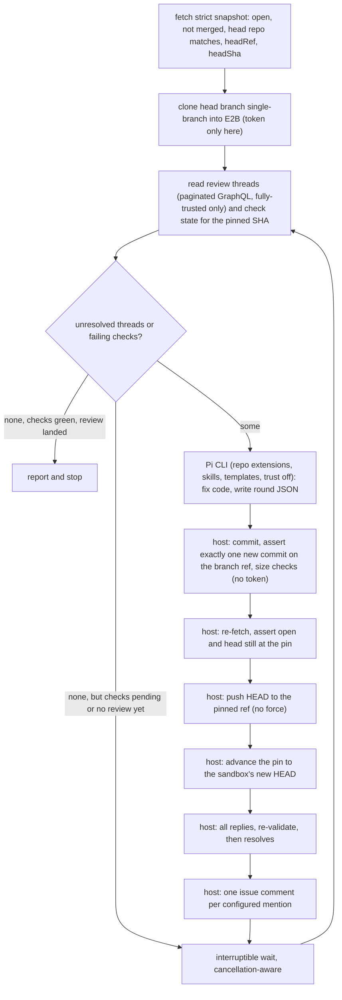

# Pi Babysit Mode

Branch `feature/pi-babysit`, off `feature/pi-search`. Rebase with `git rebase --onto staging feature/pi-search feature/pi-babysit` once #5951 merges.

## Shape

Babysit is Create PR's sandbox (clone, agent edits with bash, host commits and pushes) plus Review Code's PR pinning, wrapped in a round loop. The agent is handed no GitHub credential, no GitHub tool, and no Sim integration; every GitHub operation is host-side with arguments taken from block config, and the token appears only in the clone and push commands. That is the accurate claim. It is not an absolute guarantee: the agent has root and network in the sandbox the token transits, and the image ships `gh`, so Babysit carries the same residual exposure as Create PR (see Open decisions). Neither the plan nor the docs should describe the restriction as structurally unbreakable.

## 0. Shared extraction and push hardening first

Both reusable halves are currently module-private, and duplicating security-relevant validation is exactly what [cloud-shared.ts](apps/sim/executor/handlers/pi/cloud-shared.ts) exists to prevent.

- From [cloud-backend.ts](apps/sim/executor/handlers/pi/cloud-backend.ts) into `cloud-shared.ts`: `PREPARE_SCRIPT`, `PUSH_SCRIPT`, `DIFF_PATH`, `COMMIT_MSG_PATH`, `PUSH_ERR_PATH`, `FINALIZE_TIMEOUT_MS`, `MAX_DIFF_BYTES`, `PUSH_ERROR_MAX`.
- From [cloud-review-backend.ts](apps/sim/executor/handlers/pi/cloud-review-backend.ts) into a new `pi/github-pr.ts`: `requiredSha`, `parsePullRequestSnapshot`, `fetchPrSnapshot`, `validateRepositoryCoordinates`, `MAX_REVIEW_BODY_LENGTH`, generalized off `PiCloudReviewRunParams` to a plain `{ owner, repo, pullNumber, githubToken }`. Review Code keeps calling them; its tests must stay green unchanged.

While moving `PUSH_SCRIPT`, harden the one token-bearing command. Every command in a Pi sandbox runs as root, so the agent can write git config in any scope; the existing `core.hooksPath=/dev/null -c credential.helper= -c core.fsmonitor=` flags do not cover config-driven URL rewriting, which would send the token's userinfo to another host.

- Add `GIT_CONFIG_NOSYSTEM=1` and `GIT_CONFIG_GLOBAL=/dev/null` to the push command's env, the same pair Review Code already sets for its token-bearing fetch.
- Snapshot `.git/config` (and `.git/config.worktree` if present) as the *last* line of the clone script, after its `git remote set-url origin` rewrite — a digest taken before that line mismatches at push time and every push fails. Emit it as a marker, keep the digest host-side, and make re-verifying it the first thing the push command does, **for Babysit only**. With system and global config neutralized, repo-local is the only writable scope left, and one digest comparison covers every dangerous key — `url.*.insteadOf`, `url.*.pushInsteadOf`, `http.proxy`, `core.sshCommand`, `include.path` — including ones nobody enumerated. Scoping it to Babysit matters because it is not a pure tightening: any run that legitimately writes repo-local config would now fail its push, and Babysit is where the long-lived multi-round exposure actually is. Fold it into the push command rather than a separate `runner.run` so the existing command indices in `cloud-backend.test.ts` do not shift.
- Invoke git by absolute path (`/usr/bin/git`) in that command. Both sandbox images apt-install git on Debian, so this is now an image-shape dependency worth a note in `pi-sandbox-packages.ts`. It reduces rather than removes exposure — root can overwrite the binary too — so do not overstate it in the comment.
- Push an explicit refspec (`HEAD:refs/heads/$BRANCH`) instead of the bare branch name, so what is pushed is what was just verified rather than whatever the local branch ref points at. For Create PR this is a tightening rather than a no-op: if the agent left HEAD detached or on another branch, the old form could push a ref that does not contain the commit `PREPARE_SCRIPT` just created.

These changes alter Create PR's push command, but its existing push assertions are `toContain` checks on substrings that all survive. The shared clone script emits the digest marker for every mode, which is additive and harmless, but only Babysit's push verifies it, so Create PR's clone mocks — which return just `__BASE_SHA__` and `__DEFAULT_BRANCH__` — keep working. Babysit's own clone mocks must emit the marker, and its verification must fail closed on a missing or mismatched digest, tested before `git push` runs. Everything else in this section is a pure move, with one exception: `fetchPrSnapshot` currently rejects a closed PR inside itself, which Babysit cannot use because a PR closed mid-run must produce a graceful report rather than an exception. Split the raw fetch and parse from Review Code's "must be open" wrapper and build both modes on the raw form.

## 1. Block surface — [pi.ts](apps/sim/blocks/blocks/pi.ts)

- Add `babysit` to the mode dropdown next to the other E2B-gated modes.
- Add `const BABYSIT` and widen the existing condition constants: `owner`, `repo`, `githubToken` become `CLOUD_ANY` + babysit; `pullNumber` becomes `CLOUD_REVIEW` + babysit; `skills` stays on `AUTHORING_MODES` + babysit; the `tools` sub-block stays `LOCAL` only, so Babysit inherits zero Sim integrations.
- `task` becomes optional in this mode only: `required: { field: 'mode', value: 'babysit', not: true }` (the condition form with `not` is supported by `SubBlockConfig.required` and honored by both evaluators).
- New fields: `maxRounds` (short-input, default 3, parsed with `parseOptionalNumberInput`'s `integer`, `min: 1`, and `max: 10` — that `max` throws rather than clamping, so it is the single source of the cap and no separate constant should restate it) and `reviewMentions` (short-input, advanced, parsed as a comma-separated bounded list, **empty by default**). An empty list means "do not request re-review and do not wait for one," which is the right default for an arbitrary repository: shipping `@greptile, @cursor review` would make a non-Sim user's first run post dead comments and idle out its rounds. The docs show that value as the example.
- New outputs behind `condition: BABYSIT`: `rounds`, `threadsClean`, `checksGreen`, `threadsResolved`, `commitsPushed`, `stopReason`. Two precise booleans rather than one vague `clean`: threads and checks fail independently and a caller usually wants to branch on which. The `PiResponse` interface at the top of the same file is hand-maintained (it lists `commentsPosted?: number` today), so all six have to be declared there as well as in `outputs`.
- Update `longDescription`, `bestPractices`, and the `mode` input description, all of which currently enumerate three modes.

## 2. Handler wiring

- [backend.ts](apps/sim/executor/handlers/pi/backend.ts): add `PiBabysitRunParams extends PiContextualRunParams` with `mode: 'babysit'`, `owner`, `repo`, `githubToken`, `pullNumber`, `maxRounds`, `reviewMentions: string[]`, `executionId?: string`, `executionBudgetMs?: number`; add it to the `PiRunParams` union and add the five new fields to `PiRunResult`.
- [pi-handler.ts](apps/sim/executor/handlers/pi/pi-handler.ts): parse `mode` *before* the task check (today `if (!task) throw` runs first at line 89, so a sub-block-only change would not make the field optional at runtime), and allow an empty task for babysit. Validate inputs the way `cloud_review` does, but place the dispatch *after* `contextualBase` is built: `cloud_review` returns at line 151, before `resolvePiSkills` runs at 160-164, so a branch next to it would render the `skills` sub-block in the UI and silently ignore it. Babysit takes `skills` from `contextualBase` but passes `initialMessages: []` and no `memoryConfig` — Review Code excludes memory for exactly the reason that applies here, and `pi.mdx` already documents why a malicious PR must not be able to poison or read it. In `buildOutput`, guard the new fields with `typeof` checks the way `commentsPosted` already is, so `threadsClean: false`, `checksGreen: false`, and `rounds: 0` survive.
- Search routing: `resolveSearch` currently sends only `mode === 'cloud'` down the extension path and otherwise calls `buildPiSearchToolSpec`, whose `mode` parameter is typed `'local' | 'cloud_review'`. Babysit is a sandbox mode, so it must take the `cloud` branch; without this the mode union addition is a type error and a configured provider would silently do nothing.
- Cancellation: `ctx.abortSignal` in background executions is a timeout controller only — a user Stop travels over Redis and never aborts it, which is why [wait-handler.ts](apps/sim/executor/handlers/wait/wait-handler.ts) polls `isExecutionCancelled(executionId)`. Pass `ctx.executionId` into the babysit params. A 30-minute loop that ignores Stop keeps pushing commits to a human's PR.
- Budget: do **not** try to derive the platform deadline. `ctx.metadata.executionMode` is unreliable in both directions (the schedule and webhook paths omit it while running under the async timeout; some synchronous surfaces omit it too), fixing that means editing shared scheduling metadata that workflows read as `<start.metadata.executionMode>` — a platform behavior change shipped inside a Pi feature — and `getExecutionTimeout` returns `0` meaning *untimed* when billing is disabled, which is the default self-hosted configuration. Budget against the clamped sandbox lifetime from section 7 alone, and let the platform enforce its own ceiling. The real deadline already reaches the block as `ctx.abortSignal`, which the derived cancellation signal in section 5 consumes.
- Note for reviewers: like Review Code, Babysit calls `executeTool` directly without `assertPermissionsAllowed`, so its host-side GitHub calls are not subject to workspace tool denylists. That matches the existing pattern rather than introducing a new hole, but it should be stated so nobody assumes otherwise.
- [keys.ts](apps/sim/executor/handlers/pi/keys.ts): add `'babysit'` to `PiKeyMode` and treat it exactly like `'cloud'` (BYOK required, the model key enters the sandbox). Parameterize the existing "Create PR requires your own provider API key" message with the mode label.

## 3. GitHub operations — five new tools plus one parser field

Four are GraphQL, following the existing pattern in [list_projects.ts](apps/sim/tools/github/list_projects.ts); one is REST, following [get_workflow_run.ts](apps/sim/tools/github/get_workflow_run.ts) with a typed parser in the style of [pr.ts](apps/sim/tools/github/pr.ts). All are registered in [registry.ts](apps/sim/tools/registry.ts) and called through `executeTool`. Keying thread operations off the thread id means we never need comment database ids. Note for all four GraphQL tools: GitHub returns errors with HTTP 200 in an `errors` payload, so an ok response is not success — `list_projects.ts` is the precedent for checking it.

- `github_list_review_threads` — one page of `reviewThreads` with `pageInfo`, plus per thread `id`, `isResolved`, `path`, `line`, `comments.totalCount`, and its first N comments' `body`, `authorAssociation`, author `login`, and author `__typename`. The same query also returns the newest submitted review's author and timestamp, which costs nothing extra and feeds the review-landed signal. The caller pages threads until `hasNextPage` is false; `totalCount` is how it detects a thread whose comments were truncated.
- `github_reply_review_thread` — `addPullRequestReviewThreadReply(input: { pullRequestReviewThreadId, body })`.
- `github_resolve_review_thread` — `resolveReviewThread(input: { threadId })`.
- `github_status_check_rollup` — one GraphQL query for check state, pinned to a SHA: `repository { object(oid: $sha) { ... on Commit { statusCheckRollup { state contexts(first: 100, after: $cursor) { totalCount pageInfo nodes { __typename ... on CheckRun { name status conclusion detailsUrl databaseId isRequired(pullRequestNumber: $n) output { title summary } } ... on StatusContext { context state description targetUrl isRequired(pullRequestNumber: $n) } } } } } } }`.

  This replaces what would otherwise be two REST readers (`/commits/{ref}/check-runs` plus the combined `/commits/{ref}/status`) and a hand-rolled merge, and it is both less code and more correct. Both sources genuinely are needed — Actions and most apps report as check runs while several providers still post only legacy statuses, and this repo's own head commit carries 30 check runs *and* a Vercel commit status — but the rollup is what GitHub's own UI and `gh pr checks` read, so it merges them server-side. Three properties matter beyond the merge. It exposes `EXPECTED`, which is how a required check that has not reported for this SHA becomes visible at all; the REST endpoints simply omit it while branch protection still blocks. It exposes `STARTUP_FAILURE`, which lets the host detect an invalid workflow rather than taking the model's word for it. And `isRequired(pullRequestNumber:)` comes free, which decides whether a failing check should block the green verdict. The combined REST status also has a trap the rollup avoids: its top-level `state` is `pending` when a commit has *no* legacy statuses at all, which is the normal case for an Actions-only repo, so bucketing that field would make a green verdict unreachable.

  Parse the optional fields as nullable, not as required strings: `output.title`, `output.summary`, `detailsUrl`, `conclusion`, and a status context's `description` are all legitimately null, and Actions leaves the whole `output` block null on every run.

  On the claim that this capability is missing: `list_workflow_runs.ts` and `get_workflow_run.ts` do return Actions statuses and conclusions, but they filter on actor, branch, event, and status and do not expose `head_sha`, so nothing today can answer "is this PR's head green" across both sources. That is the gap, not a total absence of check data.
- Additive change to [pr.ts](apps/sim/tools/github/pr.ts): `parsePullRequestBranch` currently returns only `{ label, ref, sha }` and discards the REST response's `head.repo`. Add a nullable `repo_full_name`, tolerating an absent `repo` key as well as `repo: null` (the existing `pr.test.ts` fixture has no `repo` key at all, and a deleted fork sends null), and declare the new property on the PR reader's own output rather than the shared `BRANCH_REF_OUTPUT_PROPERTIES`, which `list_prs.ts` reuses with a transform that would never emit it. Comparing the full name directly is stronger than inferring fork-ness from `head.label`'s owner prefix, which cannot distinguish a same-owner fork under a different repo name — a case where we would otherwise clone the base repo and push to a same-named branch that is not the PR's head.

- `github_job_logs` — REST, `GET /repos/{owner}/{repo}/actions/jobs/{job_id}/logs`, which returns the job's plain-text log via redirect. This is the per-job endpoint, not the run-level zip archive, and for an Actions check run the check run's `databaseId` *is* the job id (a check run's own `details_url` resolves to `.../actions/runs/{run}/job/{same id}`). Section 5 explains why this is load-bearing rather than a nicety. Return only a bounded tail.

None of the five are wired into the GitHub block's operation dropdown; registry registration is enough for `executeTool`.

## 4. Privileged host operations — `apps/sim/executor/handlers/pi/babysit-github.ts`

The complete set of GitHub actions Babysit can perform. Every one takes owner, repo, and PR number from block config, never from model output.

- `fetchSnapshot` — builds on the extracted `fetchPrSnapshot`, plus a strict babysit view: `state`, `merged`, `head.ref`, `head.sha`, `head.repo_full_name`, `base.ref`, `mergeable`. Note what `github_pr_v2` actually returns: `mergeable` is `boolean | null`, never the GraphQL `'CONFLICTING'` string. Stop when the PR is not open, when it is merged, or when the head repo is not `owner/repo` (fork PRs are a v1 non-goal; compare case-insensitively, since GitHub owner and repo names are). Do **not** stop on `mergeable === false`: a base-branch conflict does not prevent pushing a descendant to the head branch, so the review fixes still land and the conflict still needs a human either way. A PR old enough to have accumulated review threads is frequently conflicting, so stopping there would make "zero threads handled" the most common outcome. Report the conflict and carry on; `null` simply means GitHub has not finished computing it, which is the normal state right after any push. Validate the head ref host-side with a `check-ref-format`-equivalent regex before it reaches any script (the host has no shell), and keep the sandbox-side `git check-ref-format` as the clone script's first line, as `FETCH_PR_SCRIPT` does.
- `assertPinned(pin, current)` — asserts `state === 'open'`, `merged === false`, head ref unchanged, base ref unchanged (an external retarget must stop the run, since not retargeting the base is one of the stated guarantees), and head SHA equal to the *current* pin (see the loop invariant in section 5; Review Code's `assertSameSnapshot` compares against a fixed original, which would abort every round after the first).
- `fetchThreads` — pages the list tool and returns only threads that are **fully readable and fully trusted**: every comment's `authorAssociation` is `OWNER`, `MEMBER`, or `COLLABORATOR`, or its author's `__typename` is `Bot` (a bot can only comment if an admin installed it), and `comments.totalCount` did not exceed the fetch cap. A thread with any untrusted or unread comment is skipped whole and counted, never partially resolved: on a public repo anyone can reply inside a bot's thread, and both dropping that reply and resolving on a partial conversation are wrong. Skipped threads keep `threadsClean` false, and when *every* remaining thread is skipped and no check is failing or pending, the run stops immediately with that reason rather than spending its rounds rediscovering it.
- `fetchCheckState(sha)` — reads the rollup for the *pinned* SHA via `object(oid:)`, never for the branch name, since a check result for the previous head says nothing about the commit we just pushed. Bucketing must **default to non-green**, which is the single most important rule here: an "everything else passes" default silently reports a blocked PR as green whenever GitHub uses a state the implementer did not enumerate.
  - A `CheckRun` whose `status` is anything other than `COMPLETED` is pending. That covers `QUEUED` and `IN_PROGRESS` but also `WAITING`, `REQUESTED`, and `PENDING`, which Actions uses for a job held by a deployment-protection or environment-approval rule — a genuinely blocked PR.
  - A completed `CheckRun` is non-blocking only for `SUCCESS`, `NEUTRAL`, `SKIPPED`, `CANCELLED`, and `STALE`. Everything else fails, *including conclusions GitHub adds later*. `STARTUP_FAILURE` therefore fails, which is what we want, and it is the host-side signal for the invalid-workflow stop.
  - A `StatusContext` is pending for `PENDING`, failing for `FAILURE` and `ERROR`, non-blocking for `SUCCESS`.
  - A rollup context in the `EXPECTED` state is pending, not absent.
  - Page `contexts` until exhausted and compare against `totalCount`; a mismatch is an error, never a truncation.
  A failing check blocks the green verdict only when `isRequired` is true or unknown — an optional lint job nobody gates on should not make Babysit churn — but every failing check, required or not, is still shown to the agent as real feedback. This is why required-versus-optional is no longer a non-goal: the rollup hands it to us in the same query.

  A failed or partial check read is a hard stop with its own reason, never "no checks." The failure-open reading satisfies the clean definition and is the most likely way this feature reports a false green, and it is reachable simply by using a token without the added permissions from section 9.
- `fetchCheckDiagnostics(failing)` — for each failing check, the text the agent actually needs. For an Actions check run that means a bounded tail of `github_job_logs` for its `databaseId`; for a third-party check run it means `output.title` and `output.summary`, which those apps do populate; and for a `StatusContext` it means `description` and `targetUrl`. See section 5 for why the log tail is not optional.
- Writes are two-phase, not per-thread reply-then-resolve: validate the pin, post every reply, re-validate, then resolve only the threads whose replies succeeded. Interleaving reply and resolve per thread makes the mid-batch head-movement behavior described in section 5 impossible to implement, because nothing sits between the two halves where a check could go. A reply that fails partway through the phase does not abort the rest — continue and resolve what succeeded — since abort-on-first-failure is the other natural reading and would silently drop the round's remaining threads.
- Known consequence, worth documenting rather than engineering around: if the replies land and the re-validation then skips the resolves, the next round sees those threads still unresolved and replies again. Recognizing our own prior reply would need the token's login and another call; a duplicate reply is a much smaller problem than the machinery to avoid it.
- `requestReview(mentions)` — one `github_issue_comment_v2` call per mention, never combined, retaining the returned comment ids. Not `github_comment_v2`: with no `path` it POSTs to `/pulls/{n}/reviews` and submits a review, which does not trigger the bots — they respond to issue comments, which is what the manual procedure in `.agents/skills/babysit/SKILL.md` uses.
- `reviewLandedSince(timestamp, ownCommentIds)` — true when either a submitted review by a bot newer than the re-review request appears in the thread query, or `github_list_issue_comments_v2` returns a newer comment whose author is a bot. The bot test applies to both halves; an unrelated human review must not satisfy it any more than an unrelated human comment does. Requiring a bot or a submitted review, rather than any trusted comment, keeps an unrelated collaborator's remark from being read as the review we asked for — though it is still an activity heuristic rather than proof that the bot we mentioned is the one that answered, and the docs should say so. The bot test is a different field on each path: GraphQL exposes `author.__typename === 'Bot'`, while the REST issue-comment items carry `user.type === 'Bot'` and snake_case `author_association`. Reaching for the GraphQL name on the REST path yields `undefined` and fails closed into "no review landed," which burns budget silently instead of erroring. Request `per_page: 100`; the tool defaults to 30, so the page cap would otherwise bound this at 300 comments. Use `since` set to the request time, exclude the ids we just posted, and compare `created_at` (the API's `since` filters on `updated_at`, so an edited old comment would otherwise match). Page until exhausted rather than reading page one: `/issues/{n}/comments` returns oldest-first, 30 per page, so a naive first-page read never sees the new comment on a busy PR and the run would wait out its whole budget. Both halves matter: a bot that answers with a review body and no comment would otherwise never satisfy the signal, and an unrelated human comment would otherwise satisfy it falsely. Without this signal at all, "zero unresolved threads" right after we resolved everything reports success before the bots have answered. Two cases must not wait on it: a run that has not requested a review yet (an already-clean PR should stop immediately, not idle out its budget), and a run configured with an empty mentions list, which is how a repo without review bots opts out of waiting. That is why the mentions field ships empty.

## 5. Babysit backend — `apps/sim/executor/handlers/pi/babysit-backend.ts`

One `withPiSandbox` call wrapping the whole run, so the clone is paid for once and persists across rounds, exactly as its doc comment describes. Fetch the snapshot, the first round's threads, and the first check read *before* creating the sandbox: an already-clean or unsupported PR should not pay for a clone, and a token missing the check permissions from section 9 should surface as a setup error rather than after a clone. `runCloudPi` guards `isBYOK` in the backend as well as in `keys.ts`; mirror that guard so a params object built by anything other than the handler cannot put a hosted key in the sandbox.

**The loop invariant.** Two values advance together every round and everything else derives from them: `pinnedHeadSha` (what GitHub's head must equal) and `roundBaseSha` (what the round's diff is measured against). Both start at the snapshot's head SHA. After a successful push, take the sandbox's `git rev-parse HEAD` as the new value for both — it is authoritative for what was just pushed. The follow-up PR fetch is a convergence check, not a gate: retry it a bounded number of times, and if GitHub ever reports a third SHA, someone else pushed and the run stops with `pushed_awaiting_confirmation`. If it simply has not caught up, advance the pin anyway, log it, and continue to the replies — the sandbox HEAD is authoritative, and stopping here would produce the pushed-commit-with-no-answered-threads outcome this loop works hardest to avoid. Holding these fixed is the single most likely way to break this feature: `PREPARE_SCRIPT` computes `git diff --quiet "$BASE_SHA" HEAD` against whatever it is given, so a stale base makes every later round report `__NEEDS_PUSH__` and count phantom commits, and a stale pin makes every later round abort with "the PR changed." Failing the pin advance *after* a push but *before* the replies is the worst outcome in the loop — an unexplained commit and no answered threads — so it must not hinge on GitHub's record catching up.

- Clone: `CLONE_SCRIPT`'s structure with `--single-branch --branch "$HEAD_REF"` (single-branch so the agent has no other remote-tracking refs to merge), assert `git rev-parse HEAD` equals the pinned SHA, then `git remote set-url origin` to the tokenless URL so the agent's bash cannot push.
- Per round: delete any previous round file, write the prompt, run the Pi CLI. A missing round file means the agent produced no decisions for that round — never reuse the previous one. Check the file's size with a shell command before reading it: the sandbox `readFile` has no bound, and the round file is agent-written.
- Repository-supplied Pi resources stay off. `buildPiScript` passes `--no-extensions` only when it is also given an extension path, so a run without search would load extension files from the PR branch into the process holding the BYOK model key. Add an option that always disables repository extensions and loads only Sim's own, and set it for Babysit; leave Create PR's current behavior alone. Extensions are not the only repository-supplied resource: the pinned `@earendil-works/pi-coding-agent@0.80.10` also loads prompt templates, project `.pi` settings, and repository skills, all of which land in the system context *above* our untrusted-content delimiters and inside a process holding the BYOK model and search keys. Pass `--no-prompt-templates --no-skills --no-approve` alongside `--no-extensions` for Babysit; all four are verified in the pinned CLI's `dist/cli/args.js`. `--no-skills` is safe because Sim's own workspace skills are inlined into the assembled prompt by the prompt builder rather than loaded by the CLI. `--no-approve` is not a fifth discovery toggle: it sets `projectTrustOverride = false`, and without it a repo containing `.pi` config or a `.agents/skills` directory sends Pi through trust resolution against an image-level default Sim does not control, inside a non-interactive process. It makes the outcome deterministic.

Deliberately **not** passing `--no-context-files`. The flag exists and would block `AGENTS.md` and `CLAUDE.md`, but those are plain prose rather than executable or config surfaces; the same "the author already had push access" bound that makes same-repo PRs acceptable covers them exactly as it covers the source files Babysit must read and edit anyway; and a large share of real review findings are "this does not match the codebase's pattern," so a convention-blind fixer works against the feature's purpose. Create PR keeps them too, so the two modes stay consistent.
- Search: when a provider is configured, write `PI_SEARCH_EXTENSION_SOURCE` and pass its path, with the same env vars Create PR uses.
- Prompt: `buildPiPrompt` with the block's instructions when non-empty, a `<review_feedback>` block carrying each actionable thread (id, path, line, author, comment bodies) and a `<failing_checks>` block carrying each failing check (name, conclusion, details URL, and its diagnostics from `fetchCheckDiagnostics`), both marked untrusted — check text is attacker-influenceable, since a PR can make a workflow print anything — and guidance adapted from `CLOUD_GUIDANCE`: no git, no PR operations, plus "write your per-thread decisions to `/workspace/sim-babysit-round.json`".

**Why the log tail is load-bearing.** The obvious design — pass the check's `output.title` and `output.summary` and tell the agent to reproduce the failure in the sandbox — does not work, for two independently verified reasons. GitHub Actions populates *no* `output.title`, `summary`, or `text` on its check runs: on this repository's head commit, 29 of 30 check runs come from the `github-actions` app and every one has all three fields null, including the failing one. So for the dominant CI provider that block would carry a job name, the word `failure`, and a URL. And the sandbox cannot reproduce the failure either: `pi-sandbox-packages.ts` installs git, gh, ripgrep, fd, Node and Python, with no bun, no pnpm, and no project dependencies, which is exactly why Create PR's own guidance says the opposite of "reproduce it" — "the project's package manager and test tooling may not be installed, so do not block on running the full build or test suite." Two modes giving contradictory instructions about the same image would be a defect on its own, and the babysit version is the false one. Without the log tail the agent either guesses a fix from a job name and pushes it to a human's PR, or honestly reports it cannot reproduce every round until the stuck detector fires — the CI half would do nothing. Guidance should therefore point at the log tail and the diff, not at running the suite, and say that a failure it cannot diagnose should be reported rather than guessed at.

The agent is also told it cannot fix a failure caused by the workflow definition, because changes under `.github/` are refused at push time. That stop is derived host-side from `STARTUP_FAILURE` or from a refused `.github/` change, not from the model asserting it — the deciding text is untrusted, so an injected summary must not be able to induce an early stop.

Bounding: truncate each thread body with the shared `MAX_REVIEW_BODY_LENGTH`, truncate each check's diagnostics to a per-check byte cap (`output.summary` is documented up to 65,535 characters, and a log tail is unbounded at the source), and cap each assembled block. Report threads or checks dropped for size rather than treating them as handled, and never declare green after dropping one.
- Finalize: `PREPARE_SCRIPT` with `BASE_SHA = roundBaseSha`, then verify the result rather than trusting it. `PREPARE_SCRIPT` ends its commit with `|| true`, so a commit that fails (planted signing config, for instance) with changes still in the worktree would report `__NO_CHANGES__`: when that marker appears, assert `git status --porcelain` is empty and fail loudly otherwise. When pushing, assert `refs/heads/$HEAD_REF` equals `HEAD`, `git merge-base --is-ancestor <pin> HEAD`, and `git rev-list --count <pin>..HEAD` equals 1. The agent holds bash all round, so "one follow-up commit, no history rewriting" is otherwise only a prompt instruction, and the ref assertion plus the explicit refspec from section 0 close the gap between what was verified and what is pushed. Then the content gates. Three of them, all cheap, all tested:
  - **Refuse to push any change under `.github/`.** This is the one hole the "Babysit inherits Create PR's posture" framing does not cover: in Create PR the instruction source is trusted block config, while here it is third-party comment text, and a workflow file added to a branch with an open PR runs with the repository's Actions secrets — a far larger capability than anything else the design denies the agent. The host already parses the `__CHANGED__` path list, so this is a filter and a stop reason. The wider class (a `postinstall` hook, a Makefile a CI job invokes) cannot be closed cheaply and is out of scope; `.github/**` is the high-value, zero-complexity cut.
  - **Cumulative, not per-round, size limits.** Keep `initialHeadSha` and enforce `MAX_CHANGED_FILES` and `MAX_DIFF_BYTES` from there to the proposed HEAD before every push. Measured per round, ten rounds could touch 500 files and ten times the diff budget while every individual round passed.
  - Then the push. A plain non-forced push rejects ordinary concurrent movement, which is the case that matters, but it is not a strict compare-and-swap — an external force-push to an ancestor could still accept our update as a fast-forward. Combined with the pin check just before it the window is tiny; state it as a bounded race rather than a guarantee.
- Reply-only rounds skip the commit entirely via `__NO_CHANGES__`, which works precisely because `roundBaseSha` advances.
- Exactly two gating validations: before the push, and between the reply phase and the resolve phase. If the head moved by the second one, the replies are already posted and only the resolves are skipped before stopping — replying is harmless at any head SHA, resolving is the judgment-sensitive half. Do not add a third check before the replies: it would either do nothing, or abort the write phase and produce the outcome the previous point exists to prevent.
- Skip the re-review mentions when the round pushed nothing. A round that classifies everything as a false positive changes no code, and asking the bots to re-review identical code is noise on someone's PR.
- Errors and totals: share only the token and cost counters across rounds. `applyPiEvent` writes `totals.errorMessage` on any error event and the handler throws whenever it is set, so a shared totals object would turn a transient round-3 provider error into a whole-run failure that discards the report describing commits already pushed and threads already resolved. Handle each round's error locally, fold it into the report, and stop with a `stopReason`. Assign the report to `finalText` at the end, as Review Code does.
- Scrubbing: the model key, GitHub token, and search key form the `secrets` array; run `scrubPiSecrets` over the round file, every reply body, the report, and any error before it is posted to GitHub, logged, or returned. Replies are agent-authored text going to a public PR.
- Push-error artifacts: `PUSH_ERR_PATH` receives the token-bearing push's stderr, and `scrubGitSecrets` exists because git output can contain `//user:token@` userinfo. In Create PR that file is written once in a sandbox that dies immediately; in Babysit the agent gets another root bash turn in the same sandbox afterwards, with network egress, so a failed round's push error would sit in `/workspace` waiting to be read and exfiltrated. Use a per-round path and `rm -f` it as soon as the host has read it, before any further Pi run. This is the one token-exposure path Babysit genuinely adds rather than inherits, and a per-command env assertion would not catch it.
- Cancellation: build one derived `AbortController` from `context.signal` plus a periodic `isExecutionCancelled` poll, exactly as `mothership-handler.ts` does, and pass that signal everywhere instead of hand-placing checks. `raceAbort` already consumes a signal, every sandbox command is wrapped in it, and `executeTool` accepts one, so a single derived signal covers the agent turn, the commit, the push, the wait, and the GitHub calls inside the reply loop — fewer moving parts and better coverage than an enumerated checkpoint list. Poll every few seconds rather than the Wait block's 500 ms; an hour-long run does not need sub-second stop latency and should not make thousands of Redis calls. Clear the interval and remove the parent-signal listener in a `finally`, as Mothership does. Cancellation propagates as a thrown error, matching the other cloud backends, but log the round summary (rounds used, commits pushed, threads resolved) first — it is the one case where the side effects that already landed are otherwise unrecoverable.
- Between rounds: one wait of `ROUND_WAIT_MS` using the existing `sleepUntilAborted` helper in `lib/data-drains/destinations/utils.ts`, which already races a cleared timer against a signal — do not hand-roll a fourth abort-aware sleep. Skip the wait when the budget cannot fit another round.
- Emit one `text` event per round so a streaming block shows progress. `buildOutput` always emits `changedFiles` and `diff`; define them as the last pushed round's, not a cumulative concatenation, and say so in the docs.

Constants: `ROUND_WAIT_MS = 300_000`, `MAX_THREADS_PER_ROUND = 30`, `MAX_PAGES = 10` for both listings, `MAX_CHANGED_FILES = 50`, `MAX_COMMENTS_PER_THREAD = 50` (one GraphQL page — a cap of 10 combined with skip-whole-on-truncation and the duplicate-reply behavior above would permanently disqualify any actively discussed thread and make `threadsClean` unreachable for that PR), `MAX_FAILING_CHECKS_IN_PROMPT = 20` and `MAX_CHECK_DIAGNOSTIC_BYTES` (a prompt bound only — passing and pending checks are counted without a cap so `checksGreen` stays computable on any repo; a single `MAX_CHECKS` covering all three buckets would refuse to run on the large monorepos Babysit targets, and this repo's own head commit already carries 31 contexts), `MAX_ROUND_FILE_BYTES`, and the shared `MAX_DIFF_BYTES`. Every one of these must fail visibly rather than silently truncating into a clean verdict, with two exceptions. `MAX_THREADS_PER_ROUND` is a work-per-round limit, not a truncation: handle that many now and the rest next round with `threadsClean` false, since erroring would make Babysit unusable on exactly the PRs it exists for. And hitting the page cap while looking for a landed review can only cause a missed positive, so that one degrades to "not landed" instead of erroring. It does not necessarily self-correct — the same oldest-first listing can miss the same comment again — but the outcome is an honest `awaiting_review` stop rather than a false clean.

The runtime budget is the clamped sandbox lifetime from section 7. Gate the start of a round on elapsed plus a round's slack, not plus a wait — the wait is separately skipped when the budget cannot fit another round, and counting it at the gate would refuse to start round one whenever the budget is close to `ROUND_WAIT_MS`. If the budget cannot fit even one round, fail with a setup error naming async triggers rather than returning a success-shaped report. Babysit really wants an async/background execution — sync ceilings are 300s free and 3000s paid, so one 300s wait already exhausts the free sync budget — and the platform enforces that, not this budget, so a sync run that overruns is killed without a stop report. Say so in the docs. `maxRounds` counts iterations that **run the agent**; an iteration that only waits does not consume one, and total waiting is bounded by the runtime budget alone. This reverses an earlier decision, and CI checks are why: clean now requires no pending checks, so with a five-minute wait and a default of three rounds, the ordinary success path — round one fixes and pushes — would spend its two remaining rounds waiting and stop `awaiting_checks` after roughly ten minutes of observed CI. That is far too short for a repo shaped like this one, whose `ci.yml` has 15 jobs and whose head commit carries 30 check runs. The other direction was equally broken: ten wait-consuming rounds imply 50 minutes of pure idling, which does not fit the sub-one-hour clamp once agent time is added, so the budget gate would refuse rounds mid-run while still paying E2B to idle. With waits uncounted the budget is the single binding constraint, which is the one number the user can actually reason about. A run that pushes a CI fix and then runs out of budget still stops `awaiting_checks` honestly, and the docs must say that this is a normal outcome needing a second trigger rather than a failure. Make `ROUND_WAIT_MS` and the cancellation poll interval injectable: every multi-round, lag, and cancellation test in section 8 otherwise straddles a real five-minute timer and an interval interleaved with awaited promises, which is where fake timers go quietly wrong, and `AGENTS.md` asks tests to avoid real timers.

Clean means all three of: no unresolved actionable threads, no blocking failing checks with none still pending, and a review landed since our last request (when mentions are configured). "Blocking" is the `isRequired` qualifier from section 4. The inter-round wait serves both bots and CI without extra machinery — after a push, checks re-run and the next round re-reads them for the new SHA.

One case that looks clean and is not: a SHA with zero checks at all satisfies "none failing, none pending." That is reachable right after a push, before the check suite materializes, and more importantly for a required check that is path-filtered or otherwise never reports — GitHub shows it as "Expected" and blocks the merge. The rollup's `EXPECTED` state covers the second case directly. For the first, remember the context names seen on the initial pinned SHA and treat any of them missing on a later SHA as pending rather than passing; it is a set difference over data already fetched.

Stop conditions, each returning a report: fully clean as defined above; PR closed or merged; rounds exhausted; runtime budget exhausted; the same unresolved thread ids, or the same failing checks, two rounds running with an unchanged pin (`stuck_threads` / `stuck_checks` — comparing the pin is the same comparison as "no new code change", since the pin advances exactly on push); a failing check whose conclusion is `STARTUP_FAILURE` or whose fix would require a refused `.github/` change, both host-derived; head moved; push rejected; `pushed_awaiting_confirmation`; a bound exceeded; a round's agent error. Report `awaiting_review` or `awaiting_checks` in place of the generic reason whenever the run ends — on budget *or* on rounds — with only bots or only CI outstanding; the generic `rounds_exhausted` tells the owner strictly less. A failed or partial check read is its own stop reason and never degrades to "no checks." Cancellation is the exception and throws.

## 6. Round contract — `apps/sim/executor/handlers/pi/babysit-round.ts`

A typebox schema in the style of [review-schema.ts](apps/sim/tools/github/review-schema.ts): `{ threads: [{ threadId, classification: 'fixed' | 'false_positive' | 'already_addressed', reply }], summary? }`, with `Check`/`Errors` parsing, a reply length cap, and `maxItems` caps. There is deliberately no `checks` array: there is nothing to reply to or resolve on a check, so the host decides check outcomes from the state it re-reads for the new SHA rather than from the model's claim (see Reviewer findings). The agent's check work shows up as commits and in `summary`. One host-side rule beyond schema validation: when the round pushed no commit, only `false_positive` and `already_addressed` may be resolved. A `fixed` classification with nothing pushed means the agent claimed a fix it did not make, and resolving on that word alone silently discards a real finding — leave those threads unresolved and record the contract violation. The host also rejects any `threadId` not in the set it fetched this round — that membership check, plus taking every other GitHub argument from block config, is what makes cross-repo and wrong-PR writes impossible. Threads the agent omitted are reported as unhandled and left unresolved.

## 7. Sandbox lifetime

[e2b.ts](apps/sim/lib/execution/remote-sandbox/e2b.ts) calls `Sandbox.create` with no lifetime, so it inherits the SDK's documented 300_000 ms default, and nothing calls `setTimeout`. Add `lifetimeMs` to `CreateSandboxOptions` and set it for the `pi` kind, clamped by a named constant at or under 3_600_000 ms and overridable by env: the E2B typings state the maximum sandbox lifetime is 1 hour for Hobby accounts and 24 hours for Pro, so passing `PI_TIMEOUT_MS` (90 minutes) would make sandbox creation fail outright for Create PR and Review Code on a Hobby key.

The plumbing is three layers, so say where each piece lives: `CreateSandboxOptions` in `remote-sandbox/types.ts`, `createSandbox` currently forwarding only `{ language }`, and `withPiSandbox` calling `createSandbox('pi')` with no options at all. The clamp belongs at the `pi` call site. Only E2B needs the fix. Daytona's `autoStopInterval` is inactivity-based in minutes, defaults to 15, and already survives a five-minute round wait, so raising it to an hour would only lengthen the reaper on an orphaned sandbox. Leave Daytona alone rather than mapping a semantically different value across. Clamp strictly *below* 3_600_000 rather than at it — one hour is the documented Hobby maximum, and betting on an exact-boundary create buys nothing. Cap the per-command Pi timeout at the sandbox lifetime in the same change: `PI_TIMEOUT_MS` resolves to 90 minutes, so after this fix a hung CLI would otherwise burn the whole lifetime and surface as an SDK error rather than a timeout. Note also that a one-hour create-time cap becomes the binding constraint for Create PR's 90-minute `PI_TIMEOUT_MS`, and that `Sandbox.setTimeout` can extend a live sandbox if that ever needs revisiting.

**Land this first, as its own change.** It fixes a bug users hit today on Create PR and Review Code — any run past five minutes — it is independently testable, and folding it into Babysit means reverting Babysit reverts the fix. Verify with a real Pi run past five minutes and document the Hobby/Pro ceiling next to `E2B_PI_TEMPLATE_ID`.

## 8. Tests

- `babysit-round.test.ts`: unknown thread ids, oversized replies, bad classifications and actions, omitted threads, secrets scrubbed out of replies.
- `babysit-github.test.ts`: the phase boundary itself — every reply attempted before any resolve, with the re-validation between the phases — plus a failed reply skipping only its own resolve and not aborting the phase; thread pagination across pages; a thread containing one untrusted comment or more comments than the cap being skipped whole rather than partially resolved; fork (via `head.repo_full_name`), closed, and merged PRs failing before any write, while both `mergeable === false` and `null` proceed with the conflict recorded in the report — section 4 deliberately does not stop on either, and a test pinning the old behavior would silently pull the implementation back; the re-review path hitting the issue-comments endpoint; `reviewLandedSince` paging past the first 30 comments, excluding our own, ignoring an untrusted commenter, and accepting a bot's submitted review with no comment; and `fetchCheckState` reading the pinned SHA rather than the branch. The check-state cases have to pin the false greens specifically, because that is the failure mode with no visible symptom: a `WAITING` or `REQUESTED` check run counts as pending; `STARTUP_FAILURE` and an unknown future conclusion both count as failing rather than falling into a passing default; `EXPECTED` counts as pending; a context present on the initial SHA and absent on a later one counts as pending; a commit with zero contexts is not green; a `StatusContext` failure is red even when every check run is green; `contexts.totalCount` exceeding what was fetched is an error; a failing non-required check is shown to the agent but does not block the verdict; and a GraphQL error payload arriving with HTTP 200 stops the run instead of reading as "no checks." Plus `fetchCheckDiagnostics` requesting the job log for an Actions check run's `databaseId`, falling back to `output` for a third-party app, and truncating both.
- Additions to `pr.test.ts`: the existing fixture with no `head.repo` key still parses, `repo: null` yields null, and a present repo yields its `full_name`. Plus new push-command assertions in `cloud-backend.test.ts` for the config digest and refspec, and a `list_prs` check that the new property is not advertised there.
- `babysit-backend.test.ts`: the multi-round invariant (round 2 pushes successfully using the advanced pin and base, a lagging PR record converging on retry, and a never-converging one stopping with `pushed_awaiting_confirmation` rather than failing the reply batch); head-movement abort; push rejection; reply-only round making no commit *in round 2*; more than one agent commit rejected; a branch ref pointing somewhere other than HEAD rejected; `__NO_CHANGES__` with a dirty worktree failing instead of passing; repository extensions disabled in the Pi command; a round agent error producing a report rather than a thrown run; cancellation during the agent run stopping the loop and propagating; no clean verdict before a review lands, but an immediate clean stop on a PR that had nothing unresolved to begin with and on an empty mentions list; no clean verdict while a check is failing or still pending; a check failing for two rounds with an unchanged pin stopping as `stuck_checks`; a `STARTUP_FAILURE` stopping immediately rather than retrying; a wait-only iteration not consuming a round from `maxRounds`; a run that pushes a fix and then exhausts its rounds reporting `awaiting_checks` rather than `rounds_exhausted`; each remaining stop condition.
- Partial-success behavior, which is where a round loop actually hurts: a resolve failing after its reply succeeded, the second review mention failing after the first landed, the head moving mid-batch (replies posted, resolves skipped, run stopped), cancellation after the push but before the replies, and accurate counters and report text after each of those.
- Credential isolation, following `cloud-backend.test.ts`'s per-command env assertions: the GitHub token appears only in the clone and push commands and never in a Pi run's env, across multiple rounds (the round count shifts call indices, which is exactly where a regression would hide). Assert too that no artifact written by a token-bearing command survives into a later Pi round, since the env assertions alone would pass while the push-error file sat in `/workspace`.
- Structural containment rather than a mislabeled injection test: unknown thread ids, ids belonging to another PR, all four `--no-*` flags present in the Pi command, no Sim tool specs reaching the babysit params (assert the handler property, not the sub-block config — advanced sub-blocks serialize past their conditions), no GitHub operation outside the allowlist, and the documented exemption that host-side GitHub calls are not subject to workspace tool denylists — asserted so the exemption is a tested property rather than an oversight. "A thread body containing instructions cannot produce a write" is ill-posed — thread bodies are deliberately given to the model, and a write is the correct outcome of a valid decision.
- Sandbox adapters: the requested lifetime is clamped below the Hobby ceiling and passed to E2B as `timeoutMs`, with Daytona unchanged.
- Content gates: a change under `.github/` blocks the push with a clear reason; cumulative changed-file and diff limits measured from `initialHeadSha` trip across rounds even when each round is individually small.
- Round contract: a `fixed` classification in a round that pushed nothing leaves the thread unresolved and records the violation.
- Additions to `pi.test.ts` (mode present, `tools` sub-block absent in Babysit, `task` optional only here), `pi-handler.test.ts` (dispatch, mode-before-task parsing, search routing, and a configured skill actually reaching the babysit params), `keys.test.ts` (BYOK required). The memory test needs a specific shape: assert that the babysit params carry an empty `initialMessages` **while `memoryType: 'conversation'` and a `conversationId` are present in the inputs**. Advanced-mode sub-blocks serialize before their condition is evaluated, so a Pi block previously configured as Create PR with conversation memory still carries those values after the user switches to Babysit — the explicit override is the only thing keeping memory out, not a redundant guard, and "loadPiMemory was not called" would be the wrong assertion.
- Budget: a lifetime that cannot fit one round fails with a setup error rather than a success-shaped report, and the round gate does not count the inter-round wait.
- Full gates as in the search PR: `bun run test`, `type-check`, `lint:check`, `format:check`, and the repo audits.

## 9. Docs — [pi.mdx](apps/docs/content/docs/en/workflows/blocks/pi.mdx)

New Babysit section: inputs, the round lifecycle, what `threadsClean` and `checksGreen` each mean and that a failing check caused by the workflow definition stops the run because `.github/` changes are refused, what it can and cannot do — stated as what Babysit hands the agent (no GitHub credential, no GitHub tool, no Sim integration; host-side operations with arguments from block config) plus the same residual-risk caveat Create PR carries, not as an unbreakable guarantee — trusted-author and skipped-thread behavior (including that a review bot operating through a plain user account rather than a GitHub App has its threads skipped; Greptile, Bugbot, and CodeRabbit are all Apps, so the defaults are fine), BYOK requirement, required token permissions, budgets and stop conditions, the recommendation to run Babysit on an async trigger (sync works but is bounded by a much shorter platform ceiling), the fact that a round which replies but cannot resolve may reply again next round, the fact that the sandbox is billed through inter-round waits, the E2B lifetime ceiling, and the same untrusted-content warning Review Code carries. Update the frontmatter description, the intro, the mode list, the outputs table, best practices, and the FAQ, all of which say there are three modes.

Token permissions need their own paragraph, with the precision the existing modes already get — `pi.mdx` currently documents Create PR as Contents read/write plus Pull requests read/write. Babysit needs more than that, and an existing Create-PR token will 403 on the new reads: check state needs Checks read, legacy statuses need Commit statuses read, job logs need Actions read, and resolving another user's thread needs write access. Note that these are not all available on a fine-grained token for every endpoint, so a classic token with `repo` or a GitHub App installation may be required. Preflight the check read before creating the sandbox so a permission problem surfaces as a setup error instead of after paying for a clone — and, per section 5, never as a green verdict.

Also document that a run which pushes a CI fix commonly ends `awaiting_checks`, because a full check suite usually outlasts the runtime budget. That is expected, not a failure: the fix is pushed and a second trigger picks up where it left off.

## Follow-up noticed but out of scope

`PREPARE_SCRIPT`'s `commit ... || true` is a pre-existing Create PR bug, not just a Babysit hazard: a failed commit there returns success with the agent's work uncommitted and unpushed. Babysit fixes it host-side for itself; fixing the shared script would change Create PR's behavior, so it belongs in its own change.

## Open decisions for the user

- **Residual token exposure — accepted.** The token-bearing push runs in the sandbox the agent had root in. Section 0 closes the practical vectors and this matches Create PR's existing posture. Signed off as Create-PR-equivalent risk rather than a guarantee that the token is unreachable; the alternatives (a manifest-based commit API, a second finalizer sandbox) were declined as disproportionate. If Create PR's commit mechanism is ever changed, Babysit follows it.
- **Validation happens at phase boundaries, not before every individual write.** Three checks per round rather than one per reply and resolve. The gap is a head move between two replies in the same phase.
- **`reviewMentions` ships empty.** Out of the box Babysit fixes and answers threads once, then stops without requesting a re-review — the iterative loop is opt-in. The alternative is defaulting to `@greptile, @cursor review`, which is right for Sim and wrong for every other repo.
- **Merge conflicts do not stop the run.** The original objective listed a conflict as a stop condition, but a base-branch conflict does not prevent pushing review fixes to the head branch, and PRs old enough to have review threads are frequently conflicting — stopping there would make "zero threads handled" the common outcome. Babysit reports the conflict and keeps working. Say so if you want the literal behavior instead.

## Non-goals for v1

Fork PRs, merge-conflict resolution, force-push or history rewriting, changes under `.github/`, and Greptile-score gating. Fork PRs and blocked `.github/` changes stop with a clear message; the rest are simply not attempted, and a merge conflict is reported while the run continues.

## Reviewer findings deliberately not adopted

- **Move the credentialed push out of the editing sandbox entirely, via a host-side `createCommitOnBranch` mutation or a second long-lived finalizer sandbox with per-round patch transfer.** The exposure is real: the agent has root before the token-bearing command runs. But it is the same primitive Create PR uses today, so this is a question of hardening a shared pattern, not of Babysit introducing one. `createCommitOnBranch` needs a file manifest with no representation for file modes (the earlier rejected version of this plan had to restrict itself to `100644` and stop on executables and symlinks), and a second sandbox doubles sandbox cost for a mode that already idles between rounds and adds a patch-transfer failure surface. Instead section 0 closes the practical vectors — system and global config neutralized, a `.git/config` digest checked at push time, absolute git path, explicit refspec — section 5 removes the one new leak Babysit would have added, and the residual risk is stated honestly in both the plan and the docs rather than papered over with a guarantee. If Create PR is ever moved to a different commit mechanism, Babysit should follow it.
- **Re-validate the snapshot before every individual GitHub write.** We validate at three phase boundaries instead: before the push, before the replies, and before the resolves. A head move between the two write phases is caught; one between two replies is not, and replies are posted even after a detected move because the alternative is a pushed commit with no answered threads. This is a deliberate, narrower reading of "re-fetch before resolving" and is listed under Open decisions.
- **Page every thread's comments.** Capped, with `comments.totalCount` used to detect truncation and skip the thread whole. Threads over the cap are rare and now fail visibly rather than being resolved on partial information.
- **Block the run on unknown or conflicting mergeability.** Neither `null` nor `false` stops Babysit now, for the same reason: a base-branch conflict does not prevent pushing a descendant to the head branch, so the review fixes still land and a human still has to resolve the conflict. It is reported, not fatal.
- **Reject Babysit outright unless the execution is async.** We resolve a real millisecond ceiling in the handler and budget against it. A paid sync run has 3000s, enough for a couple of rounds, and refusing to run is a worse answer than budgeting correctly and recommending async in the docs.
- **A model-reported `checks` array in the round contract.** Dropped rather than adopted: of `fixed`, `unrelated`, `workflow_config`, and `cannot_reproduce`, three fed only the report, and the one that changed control flow duplicated the stuck detector one round early while taking its cue from text the plan itself calls attacker-influenceable. The host already knows the failing set it fetched and can compare it across rounds. Dropping it deletes a schema branch, a membership check, a stop reason, and three tests.
