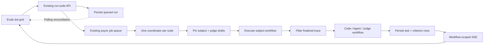

# Workflow Evals Implementation Plan

> Status: code and multi-criterion agent evaluators now run against the pinned current draft. Agent criteria use bounded finalized-trace projections, strict independent provider calls, durable billing/results, and committed criterion SSE updates. Workflow-judge execution remains the next evaluator slice.
>
> MVP definition: database-seeded suites are acceptable. MVP adds durable code, agent, and workflow evaluators against one pinned draft snapshot per run, with live graded dots. Suite authoring, cancellation, recovery automation, replayable SSE, deployment triggers, and Mothership are post-MVP.

## MVP scope

### Included

- [x] A workflow owns multiple Eval suites; each suite belongs to exactly one workflow.
- [x] Each test has a stable ID, name, workflow-start input, and exactly one evaluator.
- [ ] Support `code`, `agent`, and `workflow` evaluators behind one normalized outcome and `0–10` score model.
- [ ] Pin the subject and every judge workflow to their current drafts when the suite run starts.
- [x] Persist run, test, and criterion progress in Postgres so Redis is never authoritative.
- [x] Stream committed test and criterion changes into the existing dot grid.
- [x] Keep ordinary failed assertions separate from evaluator and infrastructure errors.
- [ ] Fail fast on invalid, missing, oversized, partial, or unauthorized evaluator data.

### Locked evaluator behavior

- [x] Agent criteria have stable IDs, short names, and descriptions; there are no configurable weights.
- [x] Each agent criterion gets an independent LLM call.
- [x] Every criterion returns exactly `pass | warning | fail`, confidence from `0–1`, and a concise evidence-based reason.
- [x] Agent score is the confidence-weighted mean of `pass = 10`, `warning = 5`, and `fail = 0`; all-zero confidence is an evaluator error.
- [x] Workflow judges return one raw finite number from `0–10`; values are never coerced or clamped.
- [x] Fixed MVP bands are `score >= 8` pass, `score >= 5` warning, and `score < 5` fail.
- [x] Workflow-judge mappings are explicit. Original test input is unavailable unless a mapping selects it.
- [x] Agent judges receive topology for every executed block, selected block outputs only, and all tool calls belonging to a selected agent block.
- [x] Judge workflows may be the subject workflow and run with ordinary workflow behavior, including side effects.
- [x] Suites remain parallel through the bounded suite queue, tests remain sequential within one suite, and criteria run with concurrency four.

## MVP architecture

## Phase 0 — Preserve the working vertical slice

- [x] Add `workflow_eval_suite` and `workflow_eval_run`.
- [x] Store stable test definitions and immutable suite-definition snapshots.
- [x] Add the feature-flagged suite GET endpoint.
- [x] Add the contract-backed run-creation endpoint.
- [x] Enqueue one suite coordinator with stable identity `eval-suite:<runId>`.
- [x] Enforce one active run per suite.
- [x] Execute persisted code tests against real draft workflows.
- [x] Run code assertions in the isolated sandbox with timeout and size limits.
- [x] Add workflow-scoped SSE with polling fallback and canonical refetch.
- [x] Add the collapsible status-dot grid, tooltips, suite-name shimmer, and Run action.
- [x] Add database seed fixtures for the current UI and runner.

### Phase 0 exit criteria

- [x] A seeded code suite executes and updates the dot grid.
- [x] The existing read, run, stream, loader, and runner tests pass.

## Phase 1 — Finalize the MVP persistence and contracts

The current migration has not shipped, so change it directly to the final MVP shape. Do not add compatibility machinery for unused local agent/workflow definitions.

### Suite and evaluator definitions

- [x] Extend code evaluators with optional `outputSelectors[]` and expose bounded selected values as `blockOutputs`.
- [x] Replace the unused agent definition with `{ type, model, criteria[], outputSelectors[] }`.
- [x] Bound agent definitions to 12 criteria and enforce unique criterion IDs.
- [x] Define reusable output selectors as `{ blockId, path }`; empty path means the whole selected output.
- [x] Replace the unused workflow definition with `{ type, workflowId, inputMappings[], scoreOutput }`.
- [x] Define each workflow input mapping as one target Start-input name plus exactly one `subjectOutput` or `testInput` source.
- [x] Store a bounded, unique `errorBlockIds[]` set on every test definition for Code, Agent, and Workflow evaluators.
- [x] Validate test input size, evaluator shape, unique IDs, selector counts, mapping counts, and total suite size before a run is queued.

### Suite run

- [x] Add immutable subject and judge snapshot references and hashes.
- [x] Persist the initiating actor and immutable billing-attribution snapshot.
- [x] Add monotonic `revision`, `updatedAt`, terminal counts, and timestamps.
- [x] Keep the existing active-run uniqueness constraint.

### Test run

- [x] Add `workflow_eval_test_run` instead of rewriting one growing run-level result array.
- [x] Store lifecycle separately from `pass | warning | fail` outcome and infrastructure error.
- [x] Store evaluator type, normalized score, bounded natural-language reason, snapshotted `errorBlockIds`, and subject/judge execution IDs.
- [x] Add unique `(runId, testId)` and the indexes required to load a run in test order.

### Criterion run

- [x] Add `workflow_eval_criterion_run` for durable independent-call progress.
- [x] Store criterion ID and ordinal, lifecycle, verdict, confidence, bounded reason, model/provider metadata, prompt version, tokens, cost, and typed error.
- [x] Add unique `(testRunId, criterionId)` and an ordinal index.
- [x] Keep prompts, filtered trace data, credentials, tool-call payloads, and chain-of-thought out of Eval persistence.

### Shared contracts and access control

- [x] Add strict shared schemas for normalized results, criterion results, test phases, and graded stream projections.
- [x] Normalize code booleans to score `10` or `0` without changing code-evaluator authoring.
- [x] Require workflow write permission to launch a run.
- [x] Require workflow read permission to list suites and open the SSE stream.
- [x] Derive workspace and workflow ownership server-side.
- [x] Enforce the Evals feature flag on every existing route.
- [x] Verify explicit same-origin/CSRF protection for the session-authenticated run POST and add it if the existing middleware does not provide it.

### Phase 1 exit criteria

- [x] Postgres can reconstruct the complete suite, run, test, and criterion UI without Redis.
- [x] Constraints reject duplicate test/criterion rows and invalid outcome/score combinations.
- [x] No obsolete run-level result shape remains in the unshipped migration.
- [x] Strict API-contract validation and migration safety checks pass.

## Phase 2 — Pin drafts and make the coordinator idempotent

### Run admission

- [x] Load the suite and validate every test before any paid execution begins.
- [ ] Capture the subject and every distinct judge draft in one consistent transaction, deduplicated by workflow ID.
- [x] Persist snapshot references so ordinary snapshot cleanup cannot remove an active or retained Eval target.
- [x] Resolve and persist billing attribution once at run creation.
- [x] Allocate stable subject execution IDs before dispatch.
- [ ] Allocate and consume stable judge and criterion-call IDs when their runnable paths are enabled.
- [x] Enqueue only `runId`; the worker reloads every canonical field from Postgres.

The transaction-safe target-capture helper already handles distinct judge workflows, but runnable admission remains intentionally code-only until the judge execution phases are implemented. Keep the judge-capture checkbox open until that path is reachable end to end.

### Background execution

- [x] Teach background workflow execution to accept a trusted snapshot ID, validate its workflow ownership, and load it as a state override.
- [x] Claim queued work with a compare-and-set transition.
- [x] Keep suite coordinators globally bounded and tests sequential within a suite.
- [x] Claim and persist each test and criterion independently with compare-and-set transitions.
- [x] Increment run revision and aggregate counts atomically after committed result changes.
- [x] On duplicate job delivery, reload rows, skip terminal work, and reject stale terminal writes.
- [x] Keep ordinary failed verdicts and test-local evaluator errors from stopping sibling tests.
- [x] Treat snapshot, authorization, billing-attribution, persistence, and coordinator failures as run-fatal.
- [x] Do not add automatic provider or workflow retries in MVP.

### Code evaluator alignment

- [x] Write code-evaluator results through the new test-run persistence path.
- [x] Map `true` to pass/10 and `false` to fail/0.
- [x] Preserve existing code sandbox isolation, timeout, memory, input, output, and reason limits.
- [x] Resolve explicit block-output selectors from the finalized subject trace before isolated execution.
- [x] Preserve every repeated occurrence and represent an unexecuted conditional block with an empty occurrence list.
- [x] Reject stale `errorBlockIds` that do not exist in the atomically captured subject draft.

### Phase 2 exit criteria

- [x] Editing a captured top-level subject draft after run creation cannot change any test in that run.
- [x] Duplicate coordinator delivery cannot duplicate executions or overwrite a terminal result.
- [ ] Every execution and judge call has stable Eval correlation metadata and billing attribution.

Direct Workflow-block dependencies, custom blocks, and agent-invoked workflow tools remain external runtime dependencies in the seeded MVP. Recursively pinning those dependency graphs requires separate executor propagation and dynamic-target policy; Phase 2 must not claim transitive immutability.

## Phase 3 — Filter finalized traces for judges

Do not add an evidence service, envelope model, internal HTTP route, duplicate trace store, or general-purpose intermediate representation. Read the finalized canonical trace directly and return only the fields required by the current evaluator.

- [x] Add one pure server-only `projectJudgeTrace(trace, selectors)` helper.
- [x] Call it only after the subject finishes and logging finalization succeeds, so it never reads a partial trace.
- [x] Walk the trace once with early-exit limits; do not clone or stringify the full trace first.
- [x] For agent judging, return the ordered block topology plus explicitly selected outputs.
- [x] Include only block ID, name, type, occurrence, execution order, status, handled-error state, timing, and loop/parallel coordinates.
- [x] Include no unselected block input/output, environment, workflow input, model thinking, provider timing, cost, or token data.
- [x] Resolve selected outputs across every repeated block occurrence.
- [x] For a selected Agent block, include every associated canonical tool call and its bounded status/input/output/error.
- [x] Build the filtered agent input once per subject test and reuse it across independent criterion calls.
- [x] For workflow judging, skip the agent projection shape and resolve explicit Start-input mappings directly from the same finalized trace.
- [x] Resolve workflow mappings and score output from the latest completed top-level occurrence, matching table workflow-column semantics.
- [x] Apply mandatory credential redaction plus the workspace PII policy while selecting values.
- [x] Treat selected outputs and tool-call content as hostile data, never prompt instructions.
- [x] Enforce hard limits before paid judging: 256 KiB total filtered data, 64 KiB per selected output, 16 KiB per tool input/output, 2,000 spans, and 500 tool calls.
- [x] Fail on a missing path, partial trace, unresolved selected value, redaction failure, or exceeded limit; never truncate or judge a preview.
- [x] Keep filtered trace data ephemeral. Persist only definitions, results, and execution IDs; remove the unused `evidenceHash` field from the unshipped schema.

### Phase 3 exit criteria

- [x] An evaluator cannot observe unselected block I/O or implicitly receive original test input.
- [x] Selected agent blocks include all and only their associated tool calls.
- [x] Loop and parallel executions remain distinguishable.
- [x] Invalid or oversized selected trace data fails before any judge cost is incurred.

## Phase 4 — Implement agent judging

- [x] Add a dedicated agent-evaluator service rather than invoking the workflow Agent or legacy Evaluator blocks.
- [x] Validate model access for the actor/workspace and resolve the provider strictly.
- [x] Limit MVP to hosted or workspace-BYOK models that require no evaluator-specific credential fields.
- [x] Fail unavailable or unknown models; never substitute a different provider or model.
- [x] Send no tools, files, memory, environment variables, workflow variables, or block data to the judge.
- [x] Make one call per criterion with concurrency four and preserve definition order.
- [x] Use strict `workflow_eval_criterion_v2` structured output with an 80-character UI-label reason, low/zero temperature where supported, a 512-token cap, and no streaming.
- [x] Validate provider output again against the shared strict schema; never repair JSON or infer fields.
- [x] Reserve usage independently for every call and release reservations in `finally`.
- [x] Attribute hosted usage with an idempotent key derived from run, test, criterion, model, and prompt version.
- [x] Add an explicit Eval billing source; keep BYOK model cost at zero.
- [x] Do not automatically retry ambiguous provider failures.
- [x] If one criterion errors, mark the test as infrastructure error, preserve completed siblings, and do not reweight surviving criteria.
- [x] Compute and persist the confidence-weighted score and fixed outcome band.
- [x] Persist bounded criterion results and model/cost metadata without prompts, raw responses, filtered traces, or chain-of-thought.

### Phase 4 exit criteria

- [x] A seeded multi-criterion agent test executes independent judge calls.
- [x] Each criterion produces a durable verdict, confidence, and bounded reason.
- [x] Malformed output, unavailable models, exhausted usage, and partial criterion failure produce explicit errors.
- [x] Billing and provider concurrency remain bounded and correctly attributed.

## Phase 5 — Implement workflow judging

- [ ] At run time, require the judge workflow to exist in the same workspace and require execute permission.
- [ ] Load the pinned judge draft and locate its manual Start block.
- [ ] Validate every configured target input against the pinned Start `inputFormat`.
- [ ] Build judge input from explicit mappings only; never name-match, spread the whole test input, omit broken mappings, or provide defaults.
- [ ] Execute the judge as a separate top-level workflow with its own execution ID and ordinary preprocessing, billing, usage limits, timeouts, and logging.
- [ ] Allow direct self-judging while propagating the normal workflow call chain and depth limit to nested Workflow blocks.
- [ ] Resolve the configured score output from the latest completed matching block occurrence.
- [ ] Accept only a finite JavaScript number from `0–10`; reject missing, string, `NaN`, infinite, array, object, and out-of-range values.
- [ ] Persist the exact raw score, derived outcome, subject execution ID, judge execution ID, and typed evaluator error.

### Phase 5 exit criteria

- [ ] A seeded workflow judge receives exactly its mapped inputs.
- [ ] Original test input appears only when an explicit `testInput` mapping selects it.
- [ ] Self-judging executes once while recursive Workflow blocks still terminate at the platform depth limit.
- [ ] Invalid mappings or judge output fail the test without corrupting the suite.

## Phase 6 — Stream and render graded progress

### Persisted and streamed state

- [x] Persist explicit test and criterion phases instead of inferring one active test from result order.
- [x] Publish compact run, test, and criterion upserts only after their Postgres writes commit.
- [x] Include a monotonic run revision and ignore stale or duplicate client events.
- [x] Keep inputs, definitions, selected values, traces, prompts, and reasons out of SSE.
- [x] Make the final agent-test event self-contained with bounded criterion IDs, verdicts, and confidences.
- [x] Include criterion IDs and short names in the canonical GET response so segment order is stable before execution.
- [x] Keep one workflow-scoped EventSource connection for concurrent suites.
- [x] Reconcile an authoritative GET snapshot after connection and retain polling fallback.

### Dot grid

- [ ] Keep one SVG per test and split agent dots into equal angular criterion segments.
- [ ] Render pass as ink, fail as red, warning as half-filled with a neutral outline, pending as a thin outline, running as an emphasized outline, and infrastructure error as an unfilled red outline.
- [ ] Render workflow score as a continuous disc whose ink fraction is `score / 10` and whose remainder is red.
- [ ] Show exact score, outcome, criterion name, and confidence in tooltip and ARIA text.
- [ ] Keep confidence textual; it does not change segment size or opacity.
- [ ] Keep suite-name shimmer while a run is active.
- [ ] Show evaluated progress while running and pass/warning/fail/error counts when complete.
- [x] Preserve suite collapse state through polling and SSE updates.
- [x] Keep decorative filler circles hidden from assistive technology.

### Phase 6 exit criteria

- [ ] Criterion completions appear live without streaming raw evaluation data.
- [ ] Reconnect, duplicate, and out-of-order events converge to Postgres state.
- [ ] One, three, and twelve-criterion dots plus workflow scores `0/5/10` render correctly and accessibly.

## Phase 7 — Verify and launch the seeded MVP internally

### Required automated verification

- [ ] Add migration and repository tests for unique rows, lifecycle/outcome constraints, scores, and atomic revisions.
- [ ] Add contract tests for definition bounds, duplicate IDs/mappings, aggregate math, strict LLM output, and raw workflow score validation.
- [ ] Add snapshot tests proving subject and judge edits cannot change an in-flight run.
- [ ] Add duplicate-delivery tests proving terminal test/criterion rows are not rerun or overwritten.
- [x] Add direct trace-filter tests for repeated blocks, loop/parallel coordinates, selected agent tool calls, prompt injection, secret/PII redaction, missing values, and hard caps.
- [x] Add agent tests for strict model resolution, independent-call concurrency, billing reservations, BYOK, and partial criterion errors.
- [ ] Add workflow-judge tests for explicit mappings, same-workspace authorization, self-judge, recursion depth, and invalid score output.
- [ ] Add SSE/UI tests for simultaneous criterion updates, stale revisions, warning versus error geometry, and tooltip/ARIA parity.
- [ ] Add a bounded-concurrency test covering concurrent suites and the maximum criterion count.
- [x] Keep all surfaces behind `workflow-evals`.

### MVP exit criteria

- [ ] Seeded code, agent, and workflow suites run without direct runtime intervention.
- [ ] Every run uses one immutable subject snapshot and one immutable snapshot per distinct judge.
- [ ] All three evaluators produce the shared score/outcome model with infrastructure errors separate.
- [ ] Live dots converge to Postgres through reconnect and polling fallback.
- [ ] No judge receives unselected data, implicit original input, credentials, or chain-of-thought.
- [ ] Subject executions, model calls, and judge workflows are billed to the correct immutable actor/workspace.
- [ ] The seeded MVP is usable by internal workspaces without suite CRUD, cancellation, or deployment integration.

---

## Post-MVP backlog

Everything below is intentionally excluded from the seeded evaluator MVP.

### Phase 8 — Add suite CRUD and authoring

#### Contracts and history

- [ ] Add contract-backed suite create, update, delete, and detail endpoints.
- [ ] Add run detail and history endpoints.
- [ ] Validate definitions at write time as well as run time.
- [ ] Add history indexes and retention-aware “execution unavailable” states.

#### Direct editor

- [ ] Add a minimal suite create/edit surface without increasing the terminal's default density.
- [ ] Add the input JSON editor and start-condition validation.
- [ ] Add evaluator selection and mode-specific fields.
- [ ] Allow validation or execution of one test before saving.
- [ ] Detect workflow start-schema drift and show explicit repair suggestions without self-healing.

#### Agent editor

- [ ] Add an allowlisted model picker that reflects workspace provider policy and key availability.
- [ ] Add a reorderable criteria editor with stable IDs, name, description, a 12-criterion cap, and no weight control.
- [ ] Add a multi-select subject-output picker grouped by block.
- [ ] Explain that topology is always included and selected tool-using agent blocks also send their tool-call inputs and outputs.
- [ ] Preserve stale selections visibly and require explicit repair.

#### Workflow-judge editor

- [ ] Put workflow judging behind Advanced mode.
- [ ] Add a same-workspace workflow picker using current drafts and allow self-selection.
- [ ] Render explicit mapping rows for pinned manual Start inputs.
- [ ] Allow each source to select a subject output or explicit original-test-input path.
- [ ] Add the single score-output picker grouped by judge block.
- [ ] Warn that judge workflows execute normal side effects and consume normal workflow usage.
- [ ] Detect missing workflows, Start inputs, blocks, paths, and cross-workspace references before save and run.

#### Phase 8 exit criteria

- [ ] Users can create, edit, validate, run, and maintain suites without database fixtures.
- [ ] Workflow drift produces actionable maintenance warnings rather than unexplained failures.

### Phase 9 — Add cancellation, retries, and stale-run recovery

#### Coordinator operations

- [ ] Persist the async coordinator backend and returned job handle; do not model ECS task identity.
- [ ] Add worker heartbeat/lease state and a watchdog for abandoned queued/running runs.
- [ ] Add indexes required for cancellation and stale-run scans.
- [ ] Add run cancellation endpoints and a Cancel action in the suite row.
- [ ] Mark cancellation in Postgres before stopping new work.
- [ ] Cancel in-flight subject/judge executions and abort direct model calls.
- [ ] Prevent stale workers from overwriting cancelled or completed rows.
- [ ] Make repeated cancellation and terminal writes idempotent.

#### Recovery and retries

- [ ] Enable coordinator retry only after checkpoint recovery is proven.
- [ ] Resume only unfinished test and criterion rows.
- [ ] Never rerun a completed subject merely because its judge failed.
- [ ] Add structured provider retryability before permitting limited model retries.
- [ ] Use stable billing event keys so Sim never double-bills a retried unit.
- [ ] Add Run All only if launching multiple suites together proves useful.

#### Phase 9 exit criteria

- [ ] Crash, retry, duplicate delivery, and cancellation stress produce no duplicate, resurrected, or permanently stuck work.
- [ ] Any app pod can inspect or stop a coordinator using its persisted backend handle.

### Phase 10 — Harden SSE replay and transport

- [ ] Add characterization tests for existing table Redis keys and wire envelopes.
- [ ] Test table replay ordering, chunking, TTL, pruning, fresh-mount tailing, and failures.
- [ ] Make the generic replay reader fail fast on corrupt or mismatched entries.
- [ ] Prevent the table metadata/read pruning race.
- [ ] Extract a generic Redis replay-buffer primitive without changing table behavior.
- [ ] Extract a generic SSE replay/heartbeat/rotation loop.
- [ ] Keep the specialized workflow-execution stream untouched.
- [ ] Add a separate `workflow-evals-streaming` flag and polling kill switch.
- [ ] Keep transport event ID separate from persisted entity revision.
- [ ] Add heartbeats, bounded rotation, replay, and prune recovery.
- [ ] Refetch Postgres on prune, corruption, version mismatch, or revision gap.
- [ ] Require workers and the Sim app to share Redis and network configuration.
- [ ] Add real-Redis and fake-EventSource chaos tests.

#### Phase 10 exit criteria

- [ ] Redis outage, app deploy, browser sleep, pruning, and reconnect always converge to Postgres.
- [ ] Table streaming behavior and legacy Redis compatibility remain unchanged.

### Phase 11 — Add deployment-triggered Evals

- [ ] Add per-suite `runOnDeploy`.
- [ ] Add trigger source and deployment run-group identity.
- [ ] Trigger opted-in suites only after a deployment succeeds.
- [ ] Link runs to the immutable deployment version.
- [ ] Surface deployment origin and version in history.
- [ ] Keep runs asynchronous and non-blocking initially.
- [ ] Preserve immutable actor and billing attribution.
- [ ] Add durable notifications for closed workspaces.
- [ ] Defer deployment gating until reliability and false-failure data justify it.

#### Phase 11 exit criteria

- [ ] Every opted-in deployment creates exactly one run per selected suite.
- [ ] Deployment success remains independent from Eval success.

### Phase 12 — Production observability, retention, and rollout

#### Verification and observability

- [ ] Test 1,000-test suites, slow consumers, app rolling deploys, Redis outages, and permission revocation.
- [ ] Recursively pin static direct Workflow-block dependencies and reject dynamic child workflow IDs until explicit allowed targets exist.
- [ ] Define separate immutability policies for custom blocks and agent-invoked workflow tools.
- [ ] Measure suite/test duration, queue time, evaluator latency, and failure categories.
- [ ] Measure SSE connections, reconnects, prunes, event lag, and revision divergence.
- [ ] Measure Redis failures, buffer pressure, and polling QPS.
- [ ] Alert on stuck runs, stale heartbeats, and repeated worker crashes.

#### Retention and rollout

- [ ] Define Eval history and referenced execution-log retention.
- [ ] Cover Eval data in deletion and export paths.
- [ ] Document billing for subject, agent-judge, and workflow-judge executions.
- [ ] Launch beyond internal workspaces only after reliability gates pass.
- [ ] Preserve polling as a canary kill switch.

#### Phase 12 exit criteria

- [ ] Postgres remains authoritative through every tested transport and worker failure.
- [ ] Production users can author, run, inspect, maintain, and automate suites without manual test messages.

### Phase 13 — Add Mothership and harness intelligence

> Detailed Mothership tool contract and cross-repository implementation plan: [EVALS_MOTHERSHIP_TOOLS_PLAN.md](./EVALS_MOTHERSHIP_TOOLS_PLAN.md).

#### Mothership operations

- [ ] Add Mothership tools to list, inspect, create, update, and archive suites, run one suite or one saved test, and inspect results.
- [ ] Add real run cancellation only after the worker can stop in-flight subject, judge-workflow, and model work.
- [ ] Add a test from a manual execution, failed run, or production log.
- [ ] Ask Mothership to explain failures or propose missing cases.
- [ ] Require explicit confirmation before changing a suite or workflow.

#### Harness intelligence

- [ ] Generate candidate tests from executions, failures, and logs.
- [ ] Identify duplicate, stale, invalid, or low-signal tests.
- [ ] Propose uncovered edge cases without automatically expanding the suite.
- [ ] Add a skill to explain failures and suggest workflow changes.
- [ ] Add an opt-in workflow-improvement loop against a suite.
- [ ] Preserve a held-out set before automated optimization.
- [ ] Warn when repeated optimization may overfit the visible suite.
- [ ] Keep every suite and workflow mutation reviewable and reversible.

#### Phase 13 exit criteria

- [ ] Mothership can operate the complete feature without privileged database access.
- [ ] Assistance reduces maintenance without silently rewriting the benchmark.
- [ ] Optimization reports distinguish training cases from held-out evaluation cases.

## Explicit MVP non-goals

- No suite CRUD or authoring UI; database fixtures are acceptable.
- No Run All, cancel action, or automatic retry.
- No coordinator heartbeat/watchdog or persisted backend job handle.
- No generic Redis replay refactor or transport chaos hardening.
- No deployment triggering or deployment blocking.
- No Mothership or automated harness optimization.
- No one background task per test.
- No block-event or token streaming.
- No persisted judge prompts, filtered trace data, or chain-of-thought.
- No cross-workspace judge workflows.
- No transitive snapshot closure for nested Workflow blocks, custom blocks, or agent-invoked workflow tools.
- No silent test repair, score coercion, selected-value truncation, or model substitution.
- No repetitions, flaky-test classification, baselines, or score distributions.
- No click-through test-detail panel in the dot grid; use compact tooltips and existing workflow logs.

## Delivery milestones

- [x] **Milestone A — Code runnable:** a seeded code suite executes real workflows.
- [x] **Milestone B — Code live:** workflow-scoped SSE updates the code-test dot grid.
- [ ] **Milestone C — Seeded evaluator MVP:** code, agent, and workflow judges share durable scores/outcomes and live graded dots.
- [ ] **Milestone D — Self-service:** users author and maintain suites without database fixtures.
- [ ] **Milestone E — Operable:** cancellation, retry, recovery, and replay hardening are complete.
- [ ] **Milestone F — Automated:** successful deployments launch opted-in suites asynchronously.
- [ ] **Milestone G — Assisted:** Mothership improves coverage without silently changing benchmarks.
