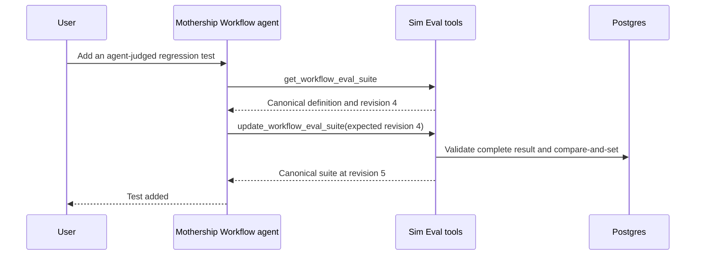
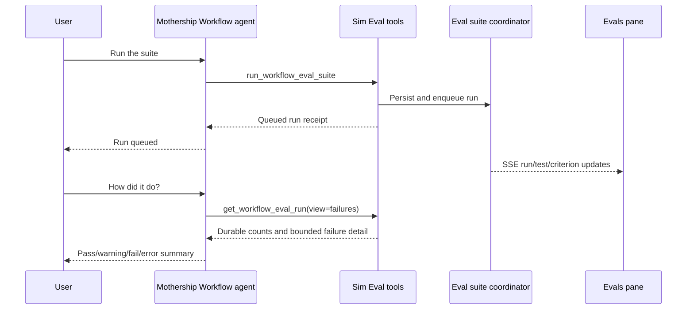

# Evals Mothership Tools Plan

> Status: implementation plan. The Eval runner already supports code, agent, and workflow evaluators. This plan gives Mothership a direct, authorized way to create, update, archive, run, and inspect suites without seed scripts or database access.

## Goal

Mothership should be able to:

- discover the Eval suites attached to the current workflow;
- inspect a suite's canonical definition;
- create a suite;
- update a suite with optimistic concurrency;
- archive a suite without erasing run history;
- queue a complete suite run against the current draft workflow;
- queue one saved test from a suite; and
- inspect durable results without waiting inside a tool call.

The first release is an authoring surface for the existing Eval runtime. It does not add test generation, deployment gates, automated workflow repair, or run-history comparison.

## Decisions

- [x] Keep the canonical Eval definition and execution logic in Sim.
- [x] Route every new tool to `sim` with `mode: async`.
- [x] Expose the tools to the Mothership Workflow subagent.
- [x] Use direct create, update, and archive tools; no prepare/apply proposal flow.
- [x] Generate suite, test, and criterion IDs on the Sim server.
- [x] Require an expected definition revision for update, archive, and run.
- [x] Archive suites instead of hard deleting them.
- [x] Queue a suite run and return immediately.
- [x] Allow one saved test to run without executing its siblings.
- [x] Continue using the existing Eval SSE channel for live UI progress.
- [x] Keep assertion failures distinct from evaluator and infrastructure errors.
- [x] Allow per-test subject block mocks whose JSON outputs flow through all evaluator types.
- [x] Fail on stale IDs, selectors, workflow drafts, revisions, and malformed scores. Do not repair or default them.
- [x] Defer cancellation until the worker can actually stop in-flight subject, judge-workflow, and model work.

## Mutation behavior

Create, update, and archive calls mutate immediately after Sim validates the complete request. There is no stored proposal or second apply call.

Mothership should call a mutation immediately when the user explicitly asks for it. If Mothership is only suggesting a change, it should describe the change and ask before calling the mutation tool. This is conversational behavior, not a second backend protocol.

Optimistic concurrency protects against stale changes: update and archive receive `expectedDefinitionRevision`, and Sim rejects the call if the suite changed after Mothership read it. The assistant must read the suite again and construct a new update rather than retrying blindly.

## Tool surface

| Tool | Purpose | Minimum permission | Product state change |
| --- | --- | --- | --- |
| `list_workflow_eval_suites` | Discover suites and latest results | Read | None |
| `get_workflow_eval_suite` | Read canonical definitions | Read | None |
| `create_workflow_eval_suite` | Create a complete suite | Write | New suite |
| `update_workflow_eval_suite` | Patch tests and suite metadata | Write | Existing suite definition |
| `archive_workflow_eval_suite` | Hide a suite while preserving history | Write | Archive state |
| `run_workflow_eval_test` | Queue one saved test from a suite | Write | One subject execution, evaluator work, cost, and possible workflow side effects |
| `run_workflow_eval_suite` | Queue a pinned-draft suite run | Write | Executions, cost, and possible workflow side effects |
| `get_workflow_eval_run` | Inspect durable run results | Read | None |

The individual-test lookup flow is deliberately ID-based:

1. `list_workflow_eval_suites` returns the suite ID.
2. `get_workflow_eval_suite` returns canonical test IDs and the definition revision.
3. `run_workflow_eval_test` receives that suite ID, test ID, and revision.
4. `get_workflow_eval_run` receives the returned run ID.

Mothership must not select a test by name or ordinal.

### 1. `list_workflow_eval_suites`

Read-only discovery for a workflow.

Input:

```json
{
  "workflowId": "workflow-id",
  "includeArchived": false,
  "limit": 50,
  "cursor": "optional-opaque-cursor"
}
```

`workflowId` may be omitted by the model only when the active Mothership context can inject it. The Sim handler must still fail when no workflow ID is available.

Output:

```json
{
  "items": [
    {
      "id": "suite-id",
      "name": "Customer support regression",
      "definitionRevision": 4,
      "testCount": 15,
      "evaluatorCounts": {
        "code": 4,
        "agent": 8,
        "workflow": 3
      },
      "archivedAt": null,
      "updatedAt": "2026-07-17T12:00:00.000Z",
      "latestRun": {
        "id": "run-id",
        "status": "completed",
        "passedCount": 12,
        "warningCount": 1,
        "failedCount": 2,
        "errorCount": 0,
        "totalCount": 15,
        "createdAt": "2026-07-17T12:10:00.000Z"
      }
    }
  ],
  "nextCursor": null
}
```

Rules:

- Return summaries only, never full test definitions.
- Exclude archived suites unless explicitly requested.
- Bound page size and serialized result bytes.
- Use opaque keyset cursors, not offsets.

### 2. `get_workflow_eval_suite`

Reads the canonical editable definition of one suite.

Input:

```json
{
  "workflowId": "workflow-id",
  "suiteId": "suite-id",
  "testIds": ["optional-test-id"],
  "limit": 50,
  "cursor": "optional-opaque-cursor"
}
```

Output includes:

- suite ID, workflow ID, name, archive state, and timestamps;
- `definitionVersion`, the persisted schema-format version that remains `1`;
- `definitionRevision`, incremented on every update or archive;
- complete requested test definitions; and
- an opaque cursor when more tests remain.

Every returned test includes its canonical `id`; agent criteria include their canonical criterion IDs. This is the source Mothership uses to select a saved test for `run_workflow_eval_test`. IDs must never be inferred from names or array positions.

```json
{
  "id": "suite-id",
  "name": "Customer support regression",
  "definitionRevision": 5,
  "tests": [
    {
      "id": "test-id",
      "name": "Answers refund question",
      "input": { "message": "Can I get a refund?" },
      "errorBlockIds": ["response-block-id"],
      "evaluator": {
        "type": "code",
        "code": "return output !== null"
      }
    }
  ],
  "nextCursor": null
}
```

Rules:

- Never silently truncate a test definition.
- If one test exceeds the Mothership result byte limit, return a typed `test_definition_too_large` error with the test ID.
- Never return raw judge prompts, raw model responses, execution traces, secrets, or hidden chain-of-thought.

### 3. `create_workflow_eval_suite`

Creates a complete validated suite.

Input:

```json
{
  "workflowId": "workflow-id",
  "name": "Customer support regression",
  "tests": [
    {
      "clientRef": "refund-policy",
      "name": "Answers refund question",
      "input": { "message": "Can I get a refund?" },
      "errorBlockIds": ["response-block-id"],
      "evaluator": {
        "type": "agent",
        "model": "gpt-4.1-mini",
        "criteria": [
          {
            "clientRef": "correctness",
            "name": "Correctness",
            "description": "The response accurately explains the refund policy."
          }
        ],
        "outputSelectors": [{ "blockId": "response-block-id", "path": "content" }]
      }
    }
  ]
}
```

New tests and criteria use unique `clientRef` values rather than model-generated IDs. Sim generates canonical IDs and returns their mapping.

Output:

```json
{
  "id": "suite-id",
  "workflowId": "workflow-id",
  "name": "Customer support regression",
  "definitionVersion": 1,
  "definitionRevision": 1,
  "testCount": 1,
  "evaluatorCounts": {
    "code": 0,
    "agent": 1,
    "workflow": 0
  },
  "generatedIds": {
    "tests": { "refund-policy": "generated-test-id" },
    "criteria": { "refund-policy/correctness": "generated-criterion-id" }
  },
  "createdAt": "2026-07-17T12:00:00.000Z",
  "updatedAt": "2026-07-17T12:00:00.000Z"
}
```

Rules:

- Validate the entire suite before inserting anything.
- Require at least one runnable test.
- Reject a duplicate active suite name for the workflow.
- Creation never implicitly runs the suite.
- Emit an audit record containing the actor, workflow, suite, and resulting definition revision.

### 4. `update_workflow_eval_suite`

Applies one atomic patch to an existing suite.

Input:

```json
{
  "workflowId": "workflow-id",
  "suiteId": "suite-id",
  "expectedDefinitionRevision": 4,
  "renameTo": "Customer support regression v2",
  "addTests": [],
  "replaceTests": [],
  "removeTestIds": [],
  "orderedTestIds": []
}
```

Patch semantics:

- `renameTo` changes the suite name.
- `addTests` contains complete new test definitions with unique `clientRef` values and an optional `afterTestId`.
- `replaceTests` contains a stable existing `testId` and one complete replacement definition.
- `removeTestIds` identifies stable existing tests.
- `orderedTestIds`, when present, contains every surviving canonical test ID exactly once.
- Existing suite and test IDs are immutable.
- Existing agent criteria retain their IDs when included by ID in a replacement definition.
- New criteria use `clientRef`, and Sim generates their canonical IDs.

Rules:

- Require at least one actual change.
- Reject unknown IDs and duplicate or conflicting operations against the same test.
- Reject partial test replacements; a replaced test must contain its full input and evaluator definition.
- Reject removal of the final runnable test.
- Validate the complete resulting suite before writing it.
- Compare-and-set `definitionRevision`; a mismatch is a conflict, not a merge.
- A currently running Eval remains unchanged because it already owns an immutable definition snapshot.
- Check the explicit user-stop signal immediately before the database mutation.
- Emit an audit record with the prior and resulting revision.

Output returns the canonical updated suite, the new `definitionRevision`, generated-ID mappings, counts, and timestamps.

### 5. `archive_workflow_eval_suite`

Archives a suite without deleting its runs.

Input:

```json
{
  "workflowId": "workflow-id",
  "suiteId": "suite-id",
  "expectedDefinitionRevision": 5
}
```

Output:

```json
{
  "suiteId": "suite-id",
  "definitionRevision": 6,
  "archivedAt": "2026-07-17T12:30:00.000Z"
}
```

Rules:

- Reject archive while the suite has a queued or running run.
- Compare-and-set the definition revision.
- Exclude archived suites from the default Evals list.
- Preserve all definition snapshots and run history.
- Do not expose hard delete until retention semantics exist.

### 6. `run_workflow_eval_test`

Queues one persisted test from a suite without running its siblings.

Input:

```json
{
  "workflowId": "workflow-id",
  "suiteId": "suite-id",
  "testId": "test-id",
  "expectedDefinitionRevision": 5
}
```

Output:

```json
{
  "runId": "run-id",
  "suiteId": "suite-id",
  "testId": "test-id",
  "scope": "test",
  "status": "queued",
  "revision": 0,
  "totalCount": 1,
  "createdAt": "2026-07-17T12:20:00.000Z",
  "workspaceId": "workspace-id",
  "workflowId": "workflow-id"
}
```

Rules:

- Resolve `testId` only within the specified suite and workflow.
- Require the exact definition revision returned by `get_workflow_eval_suite`.
- Persist a normal durable Eval run with `scope: test` and `selectedTestId`.
- Snapshot only the selected test definition plus the required subject and judge workflow drafts.
- Preallocate and execute exactly one test row and its criterion rows.
- Reuse the same subject execution, code evaluator, agent evaluator, workflow judge, billing, typed-error, and SSE paths as a full suite run.
- Preserve the existing one-active-run-per-suite rule for the first release, regardless of run scope.
- Return after durable enqueue admission; Mothership does not wait for the result.

A test-scoped run must not replace the suite's latest complete-suite baseline. Run queries and SSE events need the run scope and selected test ID so the Evals pane can overlay progress on the selected dot without collapsing the suite to a one-dot run.

### 7. `run_workflow_eval_suite`

Queues the existing suite coordinator against pinned current-draft snapshots.

Input:

```json
{
  "workflowId": "workflow-id",
  "suiteId": "suite-id",
  "expectedDefinitionRevision": 5
}
```

Output:

```json
{
  "runId": "run-id",
  "suiteId": "suite-id",
  "scope": "suite",
  "status": "queued",
  "revision": 0,
  "totalCount": 17,
  "createdAt": "2026-07-17T12:20:00.000Z",
  "workspaceId": "workspace-id",
  "workflowId": "workflow-id"
}
```

Rules:

- Require workflow write access because subject and judge workflows can have normal side effects.
- If the user explicitly asks to run, execute immediately. If Mothership is only recommending a run, ask first.
- Reject an archived suite, stale definition revision, invalid definition, or already active run.
- Call the existing `startWorkflowEvalSuiteRun`; do not duplicate snapshot, billing, queue, or SSE logic in the tool.
- Preserve the Eval run's own workspace billing attribution. Do not attribute judge work to the enclosing Mothership chat call.
- Return after durable enqueue admission. Never claim that the suite passed before it reaches a terminal state.
- Do not retry an ambiguous enqueue response automatically; return the durable `runId` and typed acceptance state.

The Evals pane continues to receive `eval.run.upsert`, `eval.test.upsert`, and `eval.criterion.upsert` events over the existing SSE stream.

### 8. `get_workflow_eval_run`

Reads one durable run and its paginated test results.

Input:

```json
{
  "workflowId": "workflow-id",
  "suiteId": "suite-id",
  "runId": "run-id",
  "view": "failures",
  "limit": 50,
  "cursor": "optional-opaque-cursor"
}
```

`view` is one of `summary`, `failures`, or `all`.

Output must include:

- run scope, selected test ID when applicable, status, revision, timestamps, and pass/warning/fail/error counts;
- the immutable suite definition revision used by the run;
- test ID, name, evaluator type, phase, outcome, exact score, bounded natural-language reason, and the snapshotted subject-workflow `errorBlockIds`;
- typed subject, evaluator, and infrastructure errors;
- subject and judge execution IDs;
- for agent evaluators, each criterion's verdict, confidence, bounded reason, and typed error; and
- a cursor when more results remain.

A completed test with `fail` or `warning` is a successful tool response containing a negative Eval result. It is not a tool execution failure. Tool failure is reserved for malformed input, authorization, missing data, persistence corruption, or infrastructure failure while reading the run.

The current Evals list projection omits persisted test and criterion reasons. This tool needs a dedicated run-detail schema and loader instead of reusing the pane summary response.

## Shared validation

Create and update must validate before committing:

- 1 MiB maximum serialized input per test;
- 1,000 tests maximum per suite;
- 10 MiB maximum serialized suite definition;
- 12 criteria maximum per agent evaluator;
- 50 output selectors maximum per code or agent evaluator;
- 50 input mappings maximum per workflow evaluator;
- 50 unique subject-workflow `errorBlockIds` maximum per test;
- unique suite, test, criterion, selector, and mapping identities in their proper scopes;
- code syntax without executing the code;
- agent model availability for the workspace;
- every subject block and output path against the current draft;
- every `errorBlockIds` reference against the current subject draft;
- judge workflow ownership, workspace membership, and execute permission;
- every judge input mapping against the draft judge's manual Start inputs; and
- every workflow judge score selector against the current draft.

Validation must not substitute a model, coerce a score, skip a test, repair a path, infer an original-input mapping, or silently drop a stale reference. Any invalid definition fails the tool call with a stable code, message, and JSON path. Nothing is written.

## Canonical evaluator definitions

The authoring boundary must reuse the existing semantics from `apps/sim/lib/api/contracts/workflow-evals.ts`.

### Code evaluator

```json
{
  "type": "code",
  "code": "return blockOutputs[0].occurrences.length === 1",
  "outputSelectors": [{ "blockId": "response-block-id", "path": "content" }]
}
```

- Available values are `input`, final workflow `output`, `metadata.durationMs`, and explicitly selected `blockOutputs`.
- Each `blockOutputs` entry contains its `blockId`, `path`, and every ordered occurrence with its value and loop/parallel coordinates.
- A selected conditional block that did not execute has an empty `occurrences` array. An executed block with a missing selected path is an evaluator error.
- The evaluator receives no environment variables.
- It returns a boolean or `{ "passed": boolean, "reason": "optional" }`.
- It normalizes only to pass/10 or fail/0.

### Agent evaluator

```json
{
  "type": "agent",
  "model": "gpt-4.1-mini",
  "criteria": [
    {
      "clientRef": "correctness",
      "name": "Correctness",
      "description": "The answer is accurate and directly addresses the request."
    }
  ],
  "outputSelectors": [{ "blockId": "answer-block-id", "path": "content" }]
}
```

- Criteria have no configurable weights.
- Each criterion is one independent model call.
- Each call returns pass, warning, or fail plus confidence and reason.
- The aggregate is the confidence-weighted mean of pass=10, warning=5, and fail=0.
- The finalized trace topology is included; selected Agent block evidence includes its tool calls.
- Unselected block I/O and original test input remain unavailable.

### Workflow evaluator

```json
{
  "type": "workflow",
  "workflowId": "judge-workflow-id",
  "inputMappings": [
    {
      "inputName": "answer",
      "source": {
        "type": "subjectOutput",
        "blockId": "answer-block-id",
        "path": "content"
      }
    },
    {
      "inputName": "request",
      "source": { "type": "testInput", "path": "" }
    }
  ],
  "scoreOutput": { "blockId": "score-block-id", "path": "result" }
}
```

- Every mapping is explicit.
- Original test input is available only through a `testInput` mapping.
- The judge runs its current draft and may judge itself.
- The selected result must be a raw finite number from 0 through 10.
- No string parsing, clamping, or score coercion is allowed.

## Sim-side implementation

### Data model

- [x] Add `definition_revision integer NOT NULL DEFAULT 1` to `workflow_eval_suite`.
- [x] Keep `definition_version` as the schema-format version constrained to `1`.
- [x] Add `archived_at timestamp NULL` to `workflow_eval_suite`.
- [x] Keep the existing workflow/name uniqueness rule so archived names remain reserved in the first release.
- [x] Add `suite_definition_revision`, `scope` (`suite` or `test`), and nullable `selected_test_id` to `workflow_eval_run`, with a check requiring exactly one selected test ID for test-scoped runs and none for suite-scoped runs.
- [x] Backfill existing runs as `scope = 'suite'`, `suite_definition_revision = 1`, and `selected_test_id = NULL` through additive column defaults.
- [x] Preserve all run history when a suite is archived.

Do not reuse `workflow_eval_run.revision`; it tracks streamed run progress. Do not hard delete suites because the current suite-to-run foreign key cascades and would erase run history.

### Domain services

- [x] Add `apps/sim/lib/workflows/evals/access.ts` with one reusable authorization and `workflow-evals` feature-flag boundary.
- [ ] Refactor the existing Eval list and run routes to use that boundary.
- [x] Add `suite-service.ts` for bounded list/get/create/update/archive operations.
- [x] Generalize run admission so the suite and single-test entry points share snapshot, row-allocation, billing, enqueue, and SSE logic.
- [x] Add `startWorkflowEvalTestRun` as a strict selected-test wrapper around the shared run admission service.
- [x] Add `run-detail-loader.ts` for bounded, cursor-paginated run/test/criterion reads including persisted reasons.
- [x] Extend run and SSE contracts with `scope` and `selectedTestId`.
- [x] Load both the latest complete-suite baseline and the latest run of either scope for each suite.
- [x] Export authoring schemas that materialize into the existing strict `WorkflowEvalTest` schema.
- [x] Use `generateId()` for every persisted suite, test, and criterion ID.
- [x] Preserve actionable errors for not found, revision conflict, active run, archived suite, invalid pagination, authorization, and feature-disabled cases.
- [ ] Add stable machine-readable error codes for every authoring and run failure.
- [x] Add audit records for create, update, archive, and run.

The services are the product boundary. Mothership tools and future HTTP authoring routes must call them; neither surface may maintain independent database mutation logic.

### Mothership server tools in Sim

The eight focused handlers are implemented together in `apps/sim/lib/copilot/tools/server/evals/workflow-evals.ts` so their shared authorization and argument conventions stay visible in one place:

- [x] `list_workflow_eval_suites`
- [x] `get_workflow_eval_suite`
- [x] `create_workflow_eval_suite`
- [x] `update_workflow_eval_suite`
- [x] `archive_workflow_eval_suite`
- [x] `run_workflow_eval_test`
- [x] `run_workflow_eval_suite`
- [x] `get_workflow_eval_run`

Then:

- [x] Register each server tool in `apps/sim/lib/copilot/tools/server/router.ts`.
- [x] Enforce write permission for create, update, archive, suite run, and test run in addition to domain authorization.
- [x] Reauthorize every model-supplied workflow and suite ID; never trust only the context workspace.
- [x] Require `context.userId` and exact workflow identity.
- [x] Forward the explicit `userStopSignal` through `ToolExecutionContext` and `server-tool-adapter.ts`; it currently stops before reaching server tools.
- [x] Check the stop signal immediately before every mutation.
- [ ] Add operation-aware labels in `apps/sim/lib/copilot/tools/tool-display.ts` and tests.
- [x] Add focused server-tool tests for authorization, agent definitions, abort boundaries, single-test queueing, and durable failure reads.
- [ ] Add exhaustive router, permission, result-byte-limit, and stable error-code coverage.

For test-scoped runs, the Evals pane should render the latest complete-suite run as its baseline and overlay the selected test's newer state. A one-test run must never replace the row with a one-dot suite. Because the first release permits only one active run per suite, the live overlay has one unambiguous source.

No legacy handler-map entry is needed for registered modern server tools. `buildServerToolHandlers()` discovers them from the server registry, but catalog entries remain mandatory for routing.

### HTTP authoring surface

Mothership does not need to call HTTP routes internally. Future editor authoring should add contract-backed routes that call the same services:

- `POST /api/workflows/[id]/evals/suites`
- `GET /api/workflows/[id]/evals/suites/[suiteId]`
- `PATCH /api/workflows/[id]/evals/suites/[suiteId]`
- `DELETE /api/workflows/[id]/evals/suites/[suiteId]` with archive semantics
- `POST /api/workflows/[id]/evals/suites/[suiteId]/tests/[testId]/runs`
- `GET /api/workflows/[id]/evals/suites/[suiteId]/runs/[runId]`

These routes are not required to unblock the initial Mothership authoring release.

## Mothership-side implementation

The catalog is owned by the Mothership repository. Sim's generator currently reads:

`../copilot/copilot/contracts/tool-catalog-v1.json`

### Catalog

- [x] Add all eight tool entries to `copilot/contracts/tool-catalog-v1.json`.
- [x] Set `route: "sim"` and `mode: "async"` on every entry.
- [x] Set `requiredPermission: "write"` on create, update, archive, suite run, and test run.
- [x] Keep list, get, and run-detail available to workflow readers.
- [x] Define bounded parameter schemas, including enums and required fields.
- [x] Keep descriptions explicit about draft execution, cost, side effects, optimistic concurrency, and fail-fast behavior.
- [x] Regenerate Sim's `tool-catalog-v1.ts` and `tool-schemas-v1.ts` with `bun run mship-tools:generate`.
- [x] Verify catalog parity with `bun run mship-tools:check`.

### Workflow subagent

- [x] Add catalog definitions under `copilot/internal/tools/catalog/workflow/` if the current Mothership branch still generates the JSON catalog from Go registrations.
- [x] Register them in `copilot/internal/tools/catalog/loader.go` when explicit loader registration is still used.
- [x] Add the tools to the workflow/build agent config (historically `copilot/internal/agents/build/config.go`; verify the current branch's Workflow subagent path).
- [x] Update the Workflow prompt under `copilot/internal/prompts/mothership/workflow/`.
- [x] Add all eight tools to the Workflow subagent's allowed tool set.
- [x] Teach the agent to inspect the current draft and exact block IDs before creating selectors or mappings.
- [x] Teach it to use list/get before updating or archiving an existing suite.
- [x] Teach it to get canonical test IDs from `get_workflow_eval_suite` before running one test.
- [x] Teach it to pass the exact `definitionRevision` it read and never retry a conflict blindly.
- [x] Teach it to mutate immediately when the user explicitly requests the change.
- [x] Teach it to ask before mutating when it is merely proposing a change.
- [x] Teach it never to create or update and then run implicitly.
- [x] Teach it to report `queued`, not `passed`, from the run receipt.
- [x] Teach it to separate failed assertions from evaluator and infrastructure errors when reading results.
- [ ] Add prompt and tool-policy tests for stale revisions, unrequested mutations, and false success claims from queued receipts.

The adjacent Mothership checkout was rebased to current `staging` before implementation. The JSON catalog path above remains authoritative because Sim's generator imports it directly.

## End-to-end flows

### Create or update a suite



### Run and inspect a suite



## Failure semantics

| Condition | Result |
| --- | --- |
| Malformed or semantically invalid definition | Tool error with stable code and JSON path; no write |
| Unknown workflow, suite, test, criterion, block, or path | Typed not-found or invalid-reference error |
| Definition revision changed | Conflict; read again and construct a new mutation |
| Duplicate active suite name | Conflict |
| Archive attempted during an active run | Conflict with active `runId` |
| Suite already has an active run | Conflict with active `runId` |
| Assertion returns fail or warning | Successful tool response containing the Eval outcome |
| Evaluator cannot produce a valid verdict or score | Typed evaluator error on that test |
| Queue admission is ambiguous | Return durable `runId` and acceptance state; do not retry blindly |
| Persisted state violates a contract | Throw immediately; never synthesize a fallback projection |

## Delivery phases

### Phase 1 — Sim authoring foundation

- [x] Add suite revisions, archives, migration, and schema mocks.
- [x] Add access, suite, and run-detail services.
- [x] Add focused domain tests for run scope, suite overlays, evaluator definitions, and revision conflicts.
- [x] Persist and expose natural-language failure reasons plus snapshotted `errorBlockIds` across all evaluator types.
- [ ] Add exhaustive domain tests for every evaluator validation and conflict path.

### Phase 2 — Sim tool handlers

- [x] Implement and register all eight server tools.
- [x] Add permissions, audit events, and stop-signal propagation.
- [x] Verify authoring delegation, durable run reads, and single-test-run behavior with focused tests.
- [ ] Add tool display labels and exhaustive router tests.

### Phase 3 — Mothership catalog and behavior

- [x] Add catalog schemas and Workflow subagent availability.
- [x] Add core authoring and run prompt policy tests.
- [x] Regenerate and verify Sim's catalog artifacts.
- [ ] Add adversarial prompt-policy tests for stale revisions, unrequested mutations, and queued receipts.

### Phase 4 — End-to-end rollout

- [ ] Create code-, agent-, and workflow-judged tests through Mothership.
- [ ] Update and archive suites through Mothership.
- [ ] Confirm mutations appear immediately in the existing Evals pane.
- [ ] Discover a canonical test ID through `get_workflow_eval_suite` and run only that test.
- [ ] Verify the partial run overlays one dot without replacing the latest complete-suite baseline.
- [ ] Queue a suite and verify live SSE dots plus Mothership run inspection.
- [ ] Verify read-only users cannot create, update, archive, or run.
- [ ] Verify stale-revision, invalid-selector, active-run, and oversized-output failures.
- [ ] Keep the release behind `workflow-evals`.

### Phase 5 — Later capabilities

- [ ] Real `cancel_workflow_eval_run` after cancellation-aware worker infrastructure exists.
- [ ] Run history and comparison tools.
- [ ] Create a test from a manual execution or production log.
- [ ] Unsaved single-test preview with an explicit persistence model.
- [ ] Restore and retention-aware hard deletion.
- [x] Block mocks.
- [ ] Deployment-trigger configuration.
- [ ] Missing-case proposals, duplicate/stale-case detection, held-out sets, and harness optimization.

## Exit criteria

- [ ] A user can ask Mothership to create, update, or archive all three evaluator types without a seed script or direct database access.
- [ ] Mothership can discover and run one saved test without executing its siblings.
- [ ] A stale Mothership read cannot overwrite a newer suite revision.
- [ ] Direct mutations validate the complete resulting suite before committing.
- [ ] A run tool returns a durable queued receipt and the existing Evals UI streams progress.
- [ ] Mothership can report exact scores, criterion confidence and reasons, and typed failures from a durable run.
- [ ] Read and write permissions, workspace boundaries, feature flags, payload limits, billing, and audit records are enforced in Sim.
- [ ] No tool silently repairs invalid definitions, hides an error, or erases run history.
