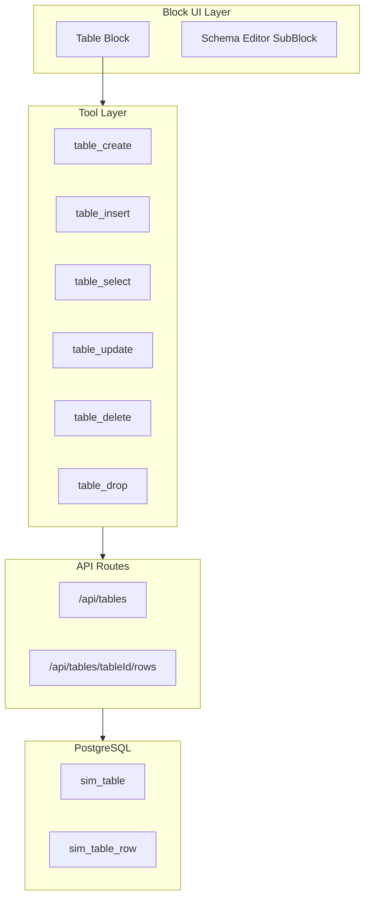

# Table Block Implementation Plan

> Create a new "table" block type that enables users to define schemas and perform CRUD operations on lightweight, workspace/workflow-scoped tables stored in the existing PostgreSQL database using JSONB with application-level schema enforcement.

## Table of Contents

- [Architecture Overview](#architecture-overview)
- [Data Model](#data-model)
- [Implementation Files](#implementation-files)
- [Key Design Decisions](#key-design-decisions)
- [Limits and Limitations](#limits-and-limitations)
- [Implementation Checklist](#implementation-checklist)

## Architecture Overview



## Data Model

Two new tables in the existing PostgreSQL database:

### `sim_table` - Table Definitions

| Column | Type | Description |
|--------|------|-------------|
| id | text | Primary key |
| workspace_id | text | FK to workspace |
| workflow_id | text | FK to workflow (nullable for workspace-scope) |
| name | text | Table name (unique per scope) |
| schema | jsonb | Column definitions with types/constraints |
| created_by | text | FK to user |
| created_at | timestamp | Creation time |
| updated_at | timestamp | Last update time |

### `sim_table_row` - Row Data

| Column | Type | Description |
|--------|------|-------------|
| id | text | Primary key |
| table_id | text | FK to sim_table |
| data | jsonb | Row data (validated against schema) |
| created_at | timestamp | Creation time |
| updated_at | timestamp | Last update time |

### Schema Format

**Example schema definition:**

```json
{
  "columns": [
    { "name": "id", "type": "string", "primaryKey": true },
    { "name": "email", "type": "string", "required": true, "unique": true },
    { "name": "age", "type": "number" },
    { "name": "active", "type": "boolean", "default": true }
  ]
}
```

**Supported Types:** `string`, `number`, `boolean`, `date`, `json`

## Implementation Files

### 1. Database Schema

- `packages/db/schema.ts` - Add `simTable` and `simTableRow` table definitions
- Generate migration for the new tables

### 2. Tools (`apps/sim/tools/table/`)

| File | Purpose |
|------|---------|
| `types.ts` | Type definitions for params/responses |
| `create.ts` | Create table with schema |
| `insert.ts` | Insert row(s) with schema validation |
| `select.ts` | Query rows with filtering |
| `update.ts` | Update rows with schema validation |
| `delete.ts` | Delete rows |
| `drop.ts` | Drop table |
| `index.ts` | Barrel export |

### 3. Block Definition

- `apps/sim/blocks/blocks/table.ts` - Block config with:
  - Operation dropdown (create, insert, select, update, delete, drop)
  - Scope selector (workspace/workflow)
  - Table selector (for existing tables)
  - Schema editor (for create operation)
  - Data/query inputs (operation-specific)

### 4. API Routes

- `apps/sim/app/api/tables/route.ts` - Create table, list tables
- `apps/sim/app/api/tables/[tableId]/route.ts` - Get/drop table
- `apps/sim/app/api/tables/[tableId]/rows/route.ts` - CRUD on rows

### 5. Schema Validation Library

- `apps/sim/lib/tables/schema.ts` - Schema validation utilities
- `apps/sim/lib/tables/types.ts` - Shared types

## Key Design Decisions

1. **Schema Enforcement**: Application-layer validation before database writes. JSONB stores data, but every insert/update validates against the table's schema.

2. **Concurrency**: PostgreSQL handles concurrent reads/writes natively. Row-level locking for updates.

3. **Indexing**: GIN index on `data` column for efficient JSONB queries. Additional indexes on `table_id` for fast row lookups.

4. **Scope Resolution**: Tables with `workflow_id = NULL` are workspace-scoped. Tables with `workflow_id` set are workflow-scoped.

5. **Table Selector**: New SubBlock type `table-selector` that fetches available tables based on current workspace/workflow context.

## Limits and Limitations

### Table Limits

| Limit | Free Plan | Pro Plan | Enterprise |
|-------|-----------|----------|------------|
| Tables per workspace | 10 | 50 | Unlimited |
| Tables per workflow | 5 | 20 | Unlimited |
| Columns per table | 50 | 100 | 200 |

### Row Limits

| Limit | Free Plan | Pro Plan | Enterprise |
|-------|-----------|----------|------------|
| Rows per table | 10,000 | 100,000 | 1,000,000 |
| Batch insert size | 100 | 500 | 1,000 |
| Batch update/delete size | 100 | 500 | 1,000 |

### Size Limits

| Limit | Value | Rationale |
|-------|-------|-----------|
| Column name length | 64 chars | PostgreSQL identifier limit |
| Table name length | 64 chars | PostgreSQL identifier limit |
| String field max length | 65,535 chars | ~64KB per text field |
| JSON field max size | 1 MB | PostgreSQL JSONB practical limit |
| Single row max size | 2 MB | Reasonable row size limit |
| Total table data size | Based on plan | Tied to workspace storage quota |

### Query Limits

| Limit | Value | Notes |
|-------|-------|-------|
| Default page size | 100 rows | Can be overridden up to max |
| Max page size | 1,000 rows | Prevents memory issues |
| Max filter conditions | 20 | AND/OR conditions combined |
| Query timeout | 30 seconds | Prevents long-running queries |
| Max concurrent queries per table | 50 | Rate limiting per table |

### Schema Constraints

| Constraint | Limit |
|------------|-------|
| Primary key columns | 1 (single column only) |
| Unique constraints | 5 per table |
| Required (NOT NULL) columns | Unlimited |
| Default values | Supported for all types |
| Foreign keys | Not supported (v1) |
| Computed columns | Not supported (v1) |
| Indexes | Auto-created for primary key and unique columns |

### Data Type Specifications

| Type | Storage | Min | Max | Notes |
|------|---------|-----|-----|-------|
| `string` | text | 0 chars | 65,535 chars | UTF-8 encoded |
| `number` | double precision | -1.7e308 | 1.7e308 | IEEE 754 double |
| `boolean` | boolean | - | - | true/false |
| `date` | timestamp | 4713 BC | 294276 AD | ISO 8601 format |
| `json` | jsonb | - | 1 MB | Nested objects/arrays |

### Operational Limitations

1. **No Transactions Across Tables**: Each operation is atomic to a single table. Cross-table transactions are not supported.

2. **No JOINs**: Cannot join data between tables. Use workflow logic to combine data from multiple tables.

3. **No Triggers/Hooks**: No automatic actions on insert/update/delete. Use workflow blocks for reactive logic.

4. **No Full-Text Search**: Basic filtering only. For full-text search, use the Knowledge Base feature.

5. **No Schema Migrations**: Schema changes require dropping and recreating the table (with data loss). Future versions may support additive migrations.

6. **Query Complexity**: Only basic operators supported:
   - Comparison: `=`, `!=`, `>`, `<`, `>=`, `<=`
   - String: `LIKE`, `ILIKE`, `STARTS_WITH`, `ENDS_WITH`, `CONTAINS`
   - Logical: `AND`, `OR`, `NOT`
   - Null checks: `IS NULL`, `IS NOT NULL`
   - Array: `IN`, `NOT IN`

### Performance Characteristics

| Operation | Expected Latency | Notes |
|-----------|------------------|-------|
| Insert (single row) | < 50ms | With schema validation |
| Insert (batch 100) | < 200ms | Parallel validation |
| Select (indexed) | < 20ms | Primary key or unique column |
| Select (filtered, 1K rows) | < 100ms | With GIN index |
| Update (single row) | < 50ms | By primary key |
| Delete (single row) | < 30ms | By primary key |

### Storage Accounting

- Table storage counts toward workspace storage quota
- Calculated as: `sum(row_data_size) + schema_overhead`
- Schema overhead: ~1KB per table
- Row overhead: ~100 bytes per row (metadata, timestamps)

## Implementation Checklist

- [ ] Add `simTable` and `simTableRow` to `packages/db/schema.ts` and generate migration
- [ ] Create `apps/sim/lib/tables/` with schema validation and types
- [ ] Create `apps/sim/tools/table/` with all 6 tool implementations
- [ ] Register tools in `apps/sim/tools/registry.ts`
- [ ] Create API routes for tables and rows CRUD operations
- [ ] Create `apps/sim/blocks/blocks/table.ts` block definition
- [ ] Register block in `apps/sim/blocks/registry.ts`
- [ ] Add `TableIcon` to `apps/sim/components/icons.tsx`
