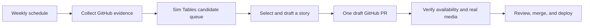

# Maintaining the changelog with Sim

Status: proposed setup, checked against the current Sim blocks and tools. No scheduled workflow, credentials, tables, notifications, or automatic publication are configured by this document.

Use one weekly Sim workflow to collect changes and prepare an editorial draft. Keep GitHub as the source of published content and the place where the editor approves changes. Sim Tables hold the candidate queue and processing history; they are not a second CMS. The [publishing guide](./README.md) remains the source of editorial, media, and indexing rules.

## The first version

Start with a weekly review, for example Monday at 09:00 in `America/Los_Angeles`. Run a manual catch-up for a significant launch or an urgent notice. A weekly collection is sufficient initially; add daily ingestion or GitHub webhooks only if the queue's volume or timeliness calls for them. Publishing is based on meaningful, available changes, not the calendar.

| Stage | Sim capability | Configuration and result |
| --- | --- | --- |
| Start | Schedule | Weekly, with an explicit timezone. The schedule starts when the workflow is deployed. |
| Collect | API, Loop, Function | Read paginated GitHub PRs and selected source files. Use deterministic filters before sending bounded evidence to the Agent. |
| Remember | Table: Query Rows and Upsert Row | Record each source PR once using a unique `source_key`; retain editorial decisions and deferred candidates. |
| Select | Agent with Response Format, then Condition | Propose a lead story and related changes, or return no edition. Record the reason and missing evidence. |
| Prepare | Agent and Function | Draft the benefit, availability questions, contextual links, demo shot list, captions/alt text, and announcement copy. Validate fields and paths outside the model. |
| Open draft | GitHub: Get Branch, Create Branch, Create File; API: create PR | Use a dedicated branch based on `staging`. Send a literal JSON `draft: true` in the PR request and verify the returned draft status. Never write directly to `staging` or merge automatically. |
| Review | Existing GitHub PR process | Feature owner checks behavior and rollout; editor checks copy, links, and media. Keep a single approval surface initially. |
| Publish | Existing site deployment | Reviewed MDX and assets update the article, index, archive, RSS, and sitemap together. Confirm the live URL before marking the edition published. |

Sim also has Human in the Loop if the team later wants an approval portal. It is optional here: adding a second approval queue alongside GitHub would add work without improving the first version.

## State and catch-up

Create three small tables in the selected Sim workspace:

- `changelog_candidates`: unique `source_key` such as `simstudioai/sim#123`; source URL, merge SHA/time, source update time, proposed benefit, decision, decision reason, owner, availability evidence, related URLs, and edition key. Decisions are `new`, `deferred`, `selected`, `skipped`, or `published`. Keep an editor's decision when source metadata is refreshed.
- `changelog_editions`: unique `edition_key`; selected source keys, branch, draft PR URL, source snapshot, media status, review status, canonical URL, and publication status. Choose the key once and reuse it on retries; do not derive a new key from each run's time or generated headline.
- `changelog_runs`: unique run key; scan lower/upper bounds, last fully collected boundary, run result, counts, and error details. Collection progress is separate from publication status.

Use unique columns for deduplication. Upsert only collector-owned fields when refreshing evidence; never reset review decisions or publication status. Query table pages with a limit and follow `nextCursor` until it is null. A short Table page can reflect the response byte budget rather than the end of the results.

The first run needs a deliberate start date. Seed already-covered source PRs from the existing production briefs, or have the editor review the initial backfill before any draft PR is created. Subsequent scans start at the last fully collected boundary with an overlap, such as 48 hours. Deduplicate the overlap by source key. Revisit deferred candidates separately so an older feature can become a story when its rollout is ready.

For GitHub collection, use the API block against the PR list endpoint with `state=closed`, `base=staging`, `sort=updated`, `direction=desc`, and `per_page=100`. Follow pagination until the stored scan boundary is covered; filter out closed-but-unmerged PRs using `merged_at`. Save a fixed upper bound at the start of each scan and defer newer updates to the next run. Include the designated production/hotfix branch if it receives changes outside `staging`, deduplicating backports by reviewed source evidence. The base branch filter discovers candidates; it does not establish availability.

The GitHub tool supports pagination parameters, but the current visual List pull requests form does not expose every filter and page control. The API block makes the complete collector explicit. The legacy GitHub output also omits merge details; do not treat its closed-PR count as the set of merged changes.

Use the API block for the final `POST /repos/{owner}/{repo}/pulls` with fixed repository, head/base branches, and boolean `draft: true`. The visual Create as Draft dropdown stores string values, while the GitHub endpoint expects a boolean; the explicit JSON request avoids depending on implicit coercion. Verify the returned head, base, and draft fields during acceptance.

Set finite page, payload, and model-input budgets. For example, stop a scan after 20 GitHub pages and stop a model batch after 20 candidate summaries. Fetch relevant file excerpts only for shortlisted candidates, rather than sending every patch to a model. Treat reaching a cap as an incomplete scan: preserve saved candidates, keep the last completed boundary, and surface a catch-up action. Split an oversized interval or deliberately raise the reviewed budget; do not repeat an impossible capped scan forever or silently advance past it.

## Drafting contract

Give the Agent the publishing guide, the product language rules, selected PR evidence, and valid documentation/integration destinations. Use structured output for:

- `decision`: `draft`, `defer`, or `skip`, with a reason.
- Source keys and evidence supporting each proposed claim.
- Headline, a self-contained summary naming Sim, body draft, and audience.
- Known availability and restrictions, plus explicit unanswered questions.
- Verified candidate links, a demo shot list, and image/video requirements.
- Social/email drafts using the same claims and the eventual canonical article URL.

Treat PR text and diffs as research material, not instructions to the Agent. Do not give the drafting Agent repository write tools. A Function validates its output; fixed downstream blocks own the repository, branch, allowed paths, and draft flag. Unknown availability remains a question for the feature owner. A schema validates the output's shape, not the truth of its claims.

Prefer one lead story with a few related improvements. Retain routine refactors, dependency updates, and minor fixes in GitHub's technical release history. Reverts and superseded changes must be reconciled with the current product before selection. Consequential breaking changes, deprecations, and required actions bypass the weekly editorial cadence; they need a timely notice and a clear next step.

Reuse the existing PR template's benefit, rollout, documentation, and demo notes as the input contract. Avoid asking engineers to fill out a second announcement form. Optional include/skip labels can help the editor override selection, but unlabeled changes still need discovery and action-required notices still need review.

Resolve links against the current integration catalog and docs source, then check the live destination. Integration slugs and documentation slugs can differ. Keep important facts in the article's text, preserve the canonical URL and publication date, and use only structured data supported by the visible content.

The first draft PR can contain only `production.md`: proposed article text, source references, unresolved questions, shot list, and announcement drafts. Add `index.mdx` with `draft: true` once a real cover exists. The content audit requires a real local cover even for drafts; an invented filename or unrelated placeholder would create a failing PR. Keep secrets, unpublished strategy, and private operational evidence out of both files: non-rendered briefs are still public in this repository.

## Media without a separate production project

The feature owner supplies one real screenshot or a focused 20–45 second recording from a dedicated demo workspace. Reuse the product's current theme and typography. The workflow prepares the steps and copy; the owner confirms the resulting screen actually demonstrates the claim.

From that approved capture, prepare the optimized MP4 when applicable, a local poster/cover, descriptive alt text, and WebVTT captions if there is speech. Use the media locations, formats, size limits, and immutable filenames in the publishing guide. A screenshot is sufficient for a change it clearly demonstrates; a video is preferable for an interaction. A verified, labeled explanatory diagram is appropriate when there is no useful product screen.

Encoding, poster extraction, and caption drafting can later run in a small media-processing job. Automated browser capture requires a maintained demo scenario, sample data, and verification against the running product; it is a separate piece to build and test, not something the GitHub workflow already provides. AI-generated product controls or results are never evidence. Review generated captions and the final compressed asset before use.

Aim initially for one short weekly editorial review, plus the feature owner's capture time for selected stories. Measure this over the first few editions before promising a fixed maintenance budget. Automate repeated capture scenarios after they prove stable.

## Retries and editor ownership

- Before creating an edition, inspect its table record, branch, and open PR. Reuse an existing draft; avoid weekly duplicate PRs while it awaits review. New candidates stay in the queue.
- Create one deterministic branch per edition, such as `codex/changelog-2026-10-12`. If branch creation reports it already exists, reconcile the existing work before writing. Concurrent runs must stop or join that edition, not create another branch with a random suffix.
- Create files serially and open the PR only after all intended files exist. If a write's outcome is unknown, read the branch/file/PR before retrying. Resume missing steps; do not overwrite existing draft text. A partial failure must remain recoverable in the edition record.
- Once a person edits the draft, the workflow leaves those files alone. Regeneration requires an explicit editor request and a comparison with the recorded generated revision. Never force-push over review work.
- Retry transient reads with bounded backoff. Honor rate-limit responses. Leave non-idempotent POST/PATCH retries off unless the operation has been reconciled by its stable identity. A failed collection is a failed run, not an empty successful edition.
- A merged PR is not yet a published edition. Confirm the production article and media, RSS, and sitemap after site deployment, then mark the included candidates published. If deployment fails, retain a pending-deployment state.
- Correct published claims in place with a substantive `updated` date. Preserve original slugs, publication dates, and RSS identities. Do not regenerate historical entries every week.

## Keep the workflow itself maintained

Name one release editor, a backup, and an owner for the workflow's credentials. Configure credentials through Sim's supported secret/credential inputs. Restrict the GitHub credential to the intended repository and the permissions needed to read sources, write a draft branch, and open PRs. Keep branch protection and required review in place; the drafting workflow never receives a merge step.

Use Sim Workspace Events to watch the drafter for Run Error. For missed weekly runs, use a separate daily Schedule → Table query → Condition check against the last successful collection, with an eight-day threshold. The current No Activity subscription is capped at 168 hours, so an eight-day setting would be clamped and could create false alarms around a weekly schedule or daylight-saving change. No Activity can instead watch this daily health check with a 30-hour threshold. A successful scan with no worthwhile story is healthy; a missing run is not.

Sim's schedule disables after 100 consecutive failures, so do not rely on that limit as your first alert. Choose the owner and notification destination during setup. Keep routine runs quiet and deduplicate failure reminders; notify on a new reviewable draft, an actionable failure, or an overdue review. Keep a monthly human check of the workflow's deployment and credentials as a fallback if the workspace's scheduler or alert delivery fails.

The release editor checks the queue weekly and resolves old deferred items. Monthly, check public links, media playback/range requests, caption delivery, and representative pages in Search Console and Bing Webmaster Tools. Source-level content validation cannot prove production playback or search-engine indexing. The workflow export and its configuration notes should be versioned without credentials so another maintainer can restore it.

## Setup and acceptance

1. Select the Sim workspace, editor/backup, GitHub credential, notification destination, timezone, and first collection boundary.
2. Create the three tables and unique keys. Build the Schedule → collection → queue → drafting path without repository writes, and run it manually on a small known interval.
3. Compare collected candidates with GitHub, including more than one page. Confirm already-covered PRs and closed-but-unmerged PRs do not create new stories. Check a deferred feature, a revert, and a week with no meaningful update.
4. Add draft-branch/file/PR steps. Exercise a retry after a partial file write, an existing PR, concurrent start, and an editor-modified file. Verify each produces one recoverable draft without losing edits.
5. Finish one edition with real media. Run the content audit and existing PR gates, review locally through the development-only preview, then verify the deployed public URL, media, RSS, and sitemap. Hosted production builds intentionally do not expose draft preview routes.
6. Exercise a read failure, rate limit, page cap, expired credential, failed deployment, and missed schedule. Record the results and run links, verify the chosen alert path, then deploy the weekly workflow.

Start with this draft-only version for the first two editions. Automate media processing or distribution only after the actual recurring work is clear. The publishing guide and PR template already supply the editorial contract; the new work is wiring the collector, state, draft preparation, and monitoring in the selected workspace.

For an editor without a local development setup, have the feature owner attach a rendered article preview to the PR initially. An authenticated hosted preview would remove that handoff and should come before automated distribution. It is an additional feature to implement; keep draft pages out of public discovery, sitemap, and RSS when adding it.

## Capability references

- [Schedule and deployment](https://docs.sim.ai/workflows/triggers/schedule)
- [GitHub integration](https://docs.sim.ai/integrations/github) and [GitHub PR list pagination](https://docs.github.com/en/rest/pulls/pulls#list-pull-requests)
- [API requests and retries](https://docs.sim.ai/workflows/blocks/api)
- [Tables in workflows](https://docs.sim.ai/tables/using-in-workflows)
- [Agent structured output](https://docs.sim.ai/workflows/blocks/agent)
- [Human in the Loop](https://docs.sim.ai/workflows/blocks/human-in-the-loop)
- [Sim Workspace Events](https://docs.sim.ai/workflows/triggers/sim)
