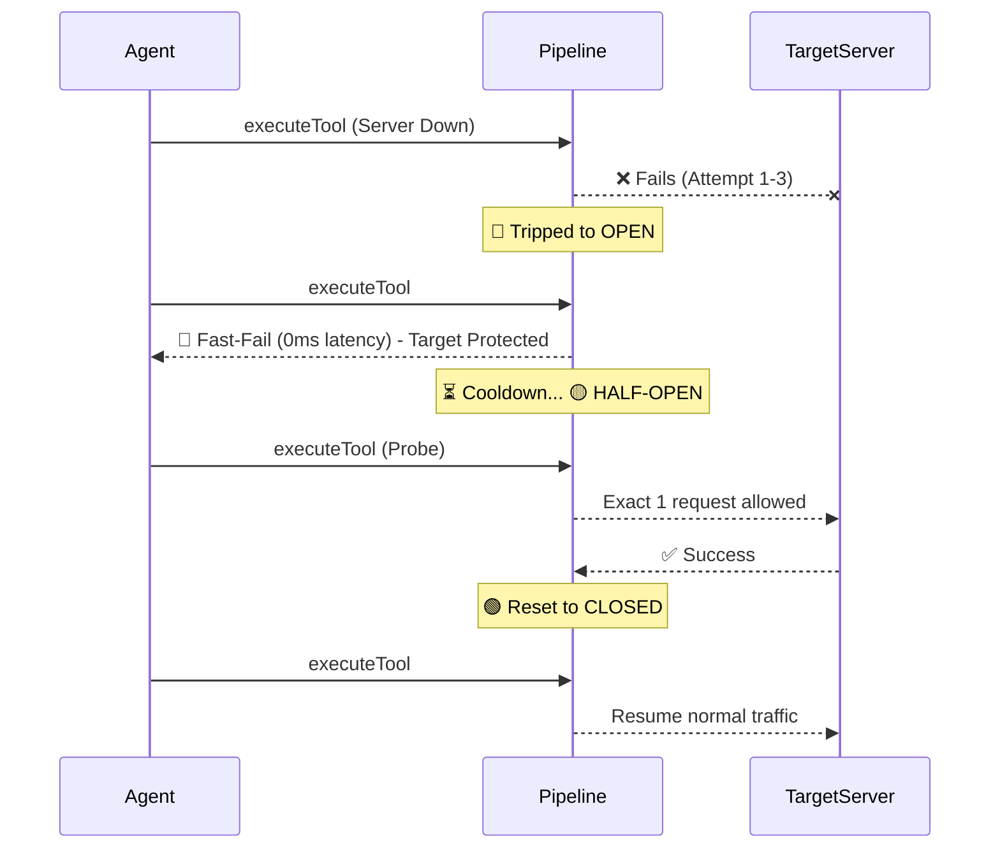

# MCP Resilience Pipeline 

**Objective:** Upgrade the core `executeTool` engine from a naive proxy to an Enterprise-Grade Resilience Pipeline, ensuring our AI workflows never suffer cascading failures from downstream server instability or LLM hallucinations.

---

## 1. The "Thundering Herd" Problem (Circuit Breaker)

**Before:**
When a downstream provider (e.g., a database or API) experienced latency or went down, our workflow engine would continuously retry. If 1,000 agents hit a struggling server simultaneously, they would overwhelm it (a DDOS-like "thundering herd"), crash our workflow executor, and severely degrade user experience across the platform.

**After (`CircuitBreakerMiddleware`):**
We implemented an intelligent State Machine with a **HALF-OPEN Concurrency Semaphore**.
- **The Trip:** If a server fails 3 times, we cut the circuit (`OPEN` state). All subsequent requests instantly *fast-fail* locally (0ms latency), protecting the downstream server from being hammered.
- **The Elegant Recovery:** After a cooldown, we allow exactly **one** probe request through (`HALF-OPEN`). If it succeeds, the circuit closes. If it fails, it trips again.

#### Live Demo Output



---

## 2. LLM Hallucinated Arguments (Schema Validator)

**Before:**
If an LLM hallucinated arguments that didn't match a tool's JSON schema, the downstream server or our proxy would throw a fatal exception. The workflow would crash, requiring user intervention, and wasting the compute/tokens already spent.

**After (`SchemaValidatorMiddleware`):**
We implemented high-performance **Zod Schema Caching**. 
- We intercept the tool call *before* it leaves our system.
- If the schema is invalid, we do *not* crash. Instead, we return a gracefully formatted, native MCP error: `{ isError: true, content: "Schema validation failed: [Zod Error Details]" }`.
- **The Magic:** The LLM receives this error, realizes its mistake, and natively **self-corrects** on the next turn, achieving autonomous self-healing without dropping the user's workflow.

---

## 3. The "Black Box" Problem (Telemetry)

**Before:**
If a tool execution tool 10 seconds or failed, we had no granular visibility into *why*. Was it a network timeout? A validation error? A 500 from the target?

**After (`TelemetryMiddleware`):**
Every single tool execution now generates rich metadata:
- `latency_ms`
- Exact `failure_reason` (e.g., `TIMEOUT`, `VALIDATION_ERROR`, `API_500`)
- `serverId` and `workspaceId`

This allows us to build real-time monitoring dashboards to detect struggling third-party integrations before our users even report them.

---

## Architectural Impact: The Composable Pipeline

Perhaps the most significant engineering achievement is the **Architecture Shift**. We moved away from a brittle, monolithic proxy to a modern **Chain of Responsibility**.

```typescript
// The new elegant implementation in McpService
this.pipeline = new ResiliencePipeline()
  .use(this.telemetry)
  .use(this.schemaValidator)
  .use(this.circuitBreaker)
```
