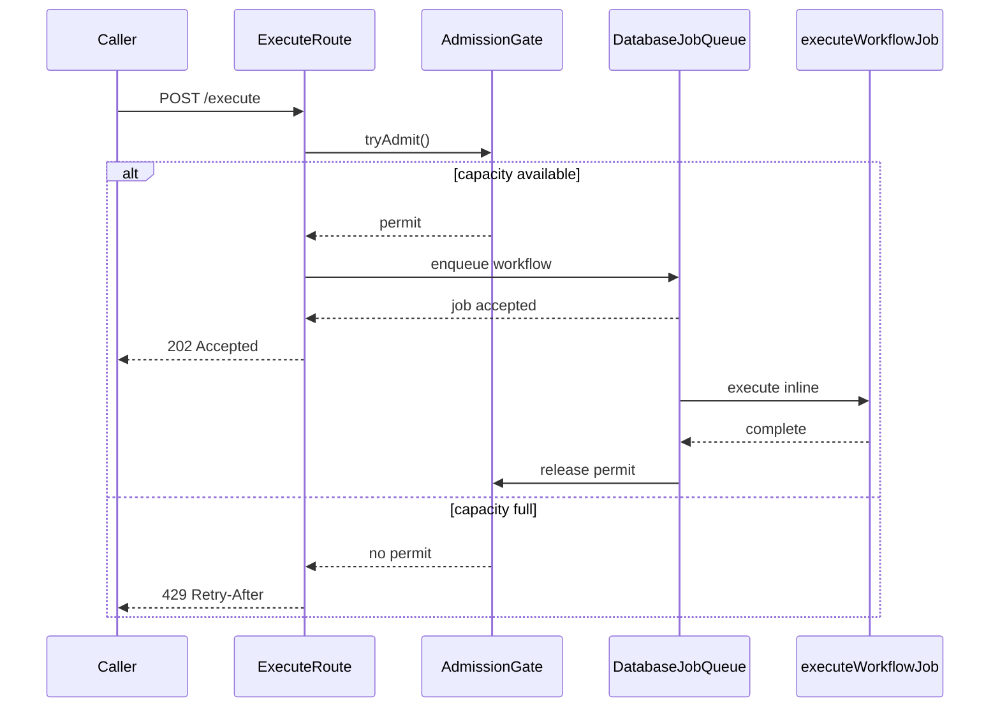

# Sim Workflow Execution: Async, Inline, and Database

## Executive summary

The local failure was not that the execute route could not return `202`
quickly. It was:

> Sim returned `202 Accepted` faster than workflows finished. The admission
> permit was released when the HTTP response returned, while the local async
> execution continued in the same process. Active work accumulated until the
> process became slow and unreachable.

The execute route has three existing execution modes:

- `sync`: the request waits for `executeWorkflowCore` and returns JSON.
- `stream`: the request returns an SSE response while `executeWorkflow` runs.
- `async`: the request queues a `workflow-execution` job and returns `202`.

`async` does not by itself mean that execution leaves the web process. The
existing async backend decides that:

- The **database backend** calls `shouldExecuteInline() === true` and runs
  `executeWorkflowJob` in the same process after inserting the job.
- **Trigger.dev** calls `shouldExecuteInline() === false` and runs the task in
  the Trigger.dev worker.

Throughput is completed workflow executions per second, not `202` responses
per second. This work improves overload behavior and protects the process; it
does not claim a production throughput increase.

Scope: local database backend, synthetic workflow, one web process. The
control-flow finding is proven by the route and backend code below. The local
load numbers are stability evidence, not a production capacity number.

## Before and after

### Before: `202` released capacity too early


### After: permit represents real in-process work



The same admission behavior now applies to cookie-backed `async` requests,
which represent the normal authenticated UI path. Session-backed `sync` and
SSE requests retain their existing response/stream lifecycle.

## Database in the current setup

The repository proves that the database can be a shared capacity limit, but it
does not prove that database latency caused the local connection-refused
cascade. The evidence is:

- `packages/db/db.ts` sets `primaryMax=10` for the web role and `primaryMax=5`
  for the Trigger.dev role. The same file documents that one run can need
  three or more simultaneous connections because of parallel queries and
  overlapping logging writes.
- `DatabaseJobQueue.enqueue` inserts into `async_jobs`. The inline runner then
  updates the job to `processing`, runs `executeWorkflowJob`, and updates the
  job to `completed` or `failed`
  ([database backend](../apps/sim/lib/core/async-jobs/backends/database.ts)).
- `executeWorkflowJob` runs preprocessing, `executeWorkflowCore`, logging
  finalization, and post-execution work
  ([workflow execution](../apps/sim/background/workflow-execution.ts)).
- `executeWorkflowCore` persists block-start and block-complete lifecycle
  markers through `LoggingSession`. The durable fallback is a
  `workflow_execution_logs` JSONB update
  ([execution core](../apps/sim/lib/workflows/executor/execution-core.ts),
  [logging session](../apps/sim/lib/logs/execution/logging-session.ts)).
- Completion reads and updates `workflow_execution_logs`, may externalize
  execution data, and reconciles usage in a transaction
  ([execution logger](../apps/sim/lib/logs/execution/logger.ts)).
- `workflow_execution_logs.execution_id` and the relevant `async_jobs` status
  indexes exist in `packages/db/schema.ts`. Indexes establish the intended
  access paths; they do not establish query latency under load.

Therefore, the DB distinction is:

- With the **database backend**, web-process execution and its `async_jobs`,
  execution-log, and usage queries share the web pool.
- With **Trigger.dev**, the web request mostly pays for enqueueing; the
  Trigger.dev task still performs execution-log and usage queries, but those
  queries use the Trigger.dev pool and the task queue limit.
- With `sync` and SSE, the web request itself waits on the same execution and
  database work. With `async` plus the database backend, the request returns
  before that work finishes, but the work still occupies the web process and
  web pool.

No repository-only claim should call the DB the measured root cause without
`pg_stat_activity`, pool-wait, query-duration, or equivalent production
measurements.

## Async and inline in Sim

These are not opposite endpoint modes:

1. `sync` calls `executeWorkflowCore` from the execute route; SSE calls
   `executeWorkflow` through `createStreamingResponse`. Both keep the
   response/stream lifecycle attached to the run.
2. `async` calls `getJobQueue().enqueue('workflow-execution', ...)` and returns
   `202`.
3. The database backend starts the job and calls `executeWorkflowJob` in the
   web process. The admission ticket must remain held until that call finishes.
4. Trigger.dev starts the task outside the web process. The route releases its
   ticket after the enqueue response; Trigger.dev applies
   `WORKFLOW_EXECUTION_CONCURRENCY_LIMIT`, whose default is `75`.

The current branch fixes only the database-backend case: it retains the
admission ticket for in-process `async` execution and releases it in the
inline runner's `finally` block. It does not change the database pool size,
Trigger.dev concurrency, or execution cost.

## Evidence

Synthetic workflow: `Start → Function`, with 300ms of deterministic CPU work.
Load profile: async `POST /api/workflows/{id}/execute`, ramp to 8 requests/sec,
then hold for 60 seconds
([Artillery profile](../apps/sim/scripts/load/workflow-concurrency.yml)).
The profile asserts the enqueue response is `202`; completion counts require
the execution-log query below.

- Before the fix: approximately 218 successful `202` responses, 225
  `ECONNREFUSED` failures, and roughly 2 completed workflows/sec. The process
  became unreachable.
- At a more aggressive 30 requests/sec probe: 351 requests returned `202`,
  approximately one completion was observed in the window, and more than 280
  executions remained running.
- With `ADMISSION_GATE_MAX_INFLIGHT=5`: 207 `429` responses and repeated
  admission-rejection logs confirmed that the admission gate rejects at
  capacity.
- After the fix: the 8 requests/sec rerun produced explicit `202`/`429`
  backpressure and did not reproduce the previous connection-refused cascade.
  One transient health check missed, so this is stability evidence, not a
  claim that the process was perfectly healthy every second.

## Changes in this branch

- Hold the admission ticket through local inline async execution:
  [execute route](../apps/sim/app/api/workflows/[id]/execute/route.ts)
- Apply the gate to session-backed async requests while preserving sync/SSE:
  [execute route](../apps/sim/app/api/workflows/[id]/execute/route.ts)
- Lower the default in-process admission limit from 500 to 10:
  [admission gate](../apps/sim/lib/core/admission/gate.ts)
- Add a 4 GB Node heap ceiling to the production start script:
  [Sim package scripts](../apps/sim/package.json)
- Add workflow execution count/duration telemetry:
  [execution metrics](../apps/sim/lib/workflows/executor/execution-metrics.ts)

The limit of 10 is a safety starting point, not an optimized production
setting. It bounds damage; it does not make execution faster.

## Other limits found or tested

### Proven by code, not measured as the local root cause

- **Execution cost:** CPU/isolated-runtime work determines how long an
  admission ticket remains occupied. More expensive workflow executions reduce
  completion rate and cause honest `429` backpressure.
- **Web database pool:** database-backend execution shares the web process and
  its `primaryMax=10` pool. The sustainable rate depends on the DB work per
  execution.
- **Trigger.dev task and DB limits:** the task definition sets a default
  concurrency limit of `75`, while the Trigger.dev DB role has a
  `primaryMax=5` pool. Queue concurrency and DB connection availability are
  separate limits.
- **Sync/SSE process pressure:** session-backed `sync` and SSE requests
  intentionally remain outside this async admission change. Their execution
  and streaming behavior needs a separate test because they run through the
  web process.

### Tested but inconclusive or not run

- A 20-request synchronous blast completed successfully; it did not reproduce
  an OOM.
- Trigger.dev’s 75/75/50 workflow, webhook, and resume queue contention was
  not tested in this session.
- No production workflow bodies were available. The synthetic graph proves the
  backlog mechanism, not production workload capacity.

## Next falsifiable measurement

Run the same profile through both API-key and authenticated-cookie async
requests. Record:

1. completed workflow executions/sec from
   `workflow_execution_logs.ended_at`;
2. `202` versus `429` responses;
3. running execution count;
4. process health and RSS;
5. `pg_stat_activity` for `sim-app` and `sim-trigger`.

The following query makes the DB part falsifiable during the run:

```sql
SELECT application_name, state, count(*) AS connections,
       max(now() - query_start) AS oldest_query
FROM pg_stat_activity
WHERE application_name IN ('sim-app', 'sim-trigger')
GROUP BY application_name, state
ORDER BY application_name, state;
```

Then vary deterministic workflow work from 300ms to 2 seconds. A valid next
finding is: completed workflow executions/sec falls and `429` rate rises
while the process stays healthy. A DB finding requires the same run to show
pool saturation or query wait/duration growth, rather than inferring it from
`202` latency alone.
