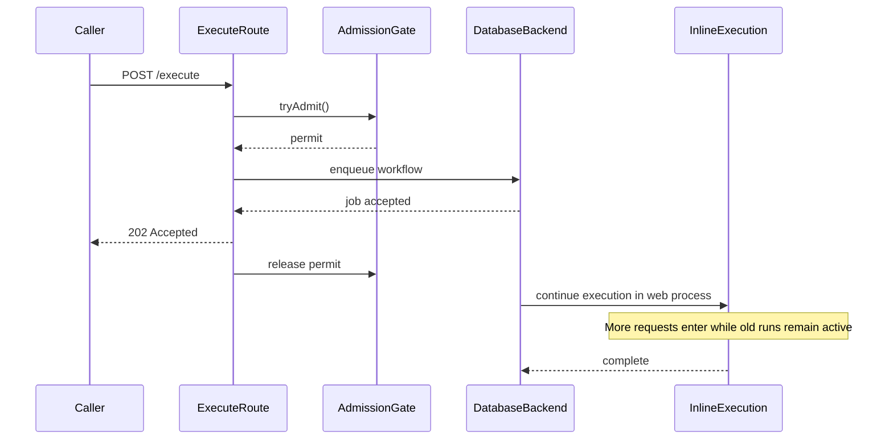
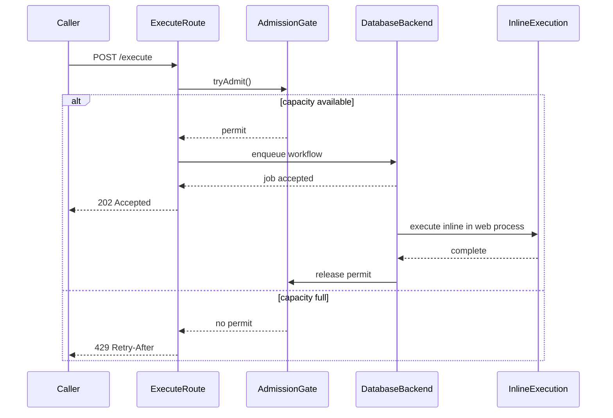
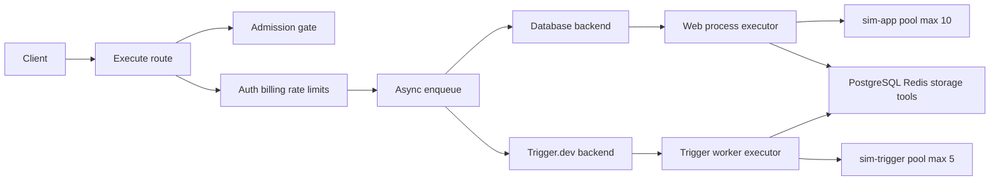

# Sim workflow execution throughput and bottlenecks

## Executive summary

The incident was not that the execute route could not return `202` quickly. The
database-backed async path released its admission permit when the HTTP response
returned, while the workflow continued in the web process. Requests accumulated
until the process became slow and unreachable.

The fix in PR 5791 keeps the permit until local inline execution finishes. This
improves overload behavior and makes backpressure visible as `429`; it does not
claim that workflow execution itself became faster.

Throughput means terminal workflow executions per second. `202` responses per
second measure request admission, not completed work.

## Scope and measurement contract

- **Local evidence:** one web process, database async backend, synthetic workflow.
- **Production evidence:** Trigger.dev async backend, worker process, Trigger.dev
  queue limits, trigger DB pool, and shared PostgreSQL/Redis.
- **Success throughput:** completed execution-log rows per second:
  `status = 'completed'`, `level = 'info'`, grouped by `ended_at`.
- **Terminal throughput:** completed, failed, and cancelled rows per second,
  grouped by `ended_at`. Exclude `pending`; it represents a paused run.
- **Admission signals:** `202`, `429`, `503`, response latency, and enqueue
  acceptance. These explain backpressure but are not throughput.
- **Saturation signals:** running execution count, worker/queue depth, DB pool
  pressure, Redis errors, CPU, RSS, and heap.

The branch adds `workflow.execution.count` and
`workflow.execution.duration` in
[execution-metrics.ts](../apps/sim/lib/workflows/executor/execution-metrics.ts).
Until production export and every terminal path are validated, use the database
terminal rows as the immediate ground truth. The current OTel recorder is
secondary because some completion paths only emit telemetry when trace spans are
present. Trigger.dev queue depth is also external to Sim; `async_jobs` is only a
database-backend proxy.

### Before: the permit represented the HTTP response



### After: the permit represents in-process work



### Local and production execution paths



## Bottleneck register

Each Evidence entry is a falsifier, not merely a plausible explanation. A
chokepoint is proven only when the stated resource signal saturates while
terminal throughput plateaus or degrades, and the alternative signals do not
explain the result.

| Bottleneck | Scope / status | Evidence (replayable falsifier) | Fix |
|---|---|---|---|
| Admission permit released before database-backed async work finished | Local database backend / **fixed in PR 5791** | Run `workflow-concurrency.yml` at `8` RPS with the pre-fix behavior: high `202`, rising `ECONNREFUSED`, and low terminal completions. Repeat after the fix: `429` appears at the configured cap and the health endpoint remains reachable. Count terminal rows with the SQL below. | Retain the ticket until `executeWorkflowJob` finishes; release it in the inline runner’s `finally`. |
| Admission setting does not match deployed process capacity | Web pods / **code default 10, Helm and docker-compose override 500** | Set `ADMISSION_GATE_MAX_INFLIGHT=5`, run the baseline above the cap, and verify `429` responses plus `Admission gate rejecting request` logs. Compare the same run with the deployed value and record whether running work exceeds the intended per-pod budget. | Align deployment overrides with measured per-pod capacity, or document why a higher value is safe. |
| Workflow work duration limits completion rate | Local and production | Use identical workflows with deterministic work of approximately `300 ms`, `1 s`, and `2 s`. Hold arrival rate constant; terminal throughput should fall as duration rises while the process remains healthy. If it does not, CPU duration is not the binding limit. | No workflow fix by itself; tune admission/worker concurrency or reduce work cost after measuring. |
| Web DB pool is shared with inline execution | Local database backend / `sim-app` primary pool max 10 | During a load hold, poll `pg_stat_activity` by `application_name`. A DB choke requires `sim-app` active connections near 10, rising query age or lock wait, and flat terminal throughput. Pool size alone is not proof. | Keep inline admission bounded; reduce queries per execution; optimize or move eligible reads only after runtime evidence. |
| Trigger worker concurrency exceeds the trigger DB pool | Production/staging Trigger.dev only / not locally reproduced | Run the same profile with Trigger.dev enabled. Prove the choke only when Trigger pending/running work grows, `sim-trigger` reaches its pool ceiling of 5, DB/query latency rises, and terminal throughput stays flat. | Size worker concurrency to the scarce downstream resource or add a shared DB-borrow semaphore. |
| Independent Trigger.dev queues contend for one worker resource | Production/staging only / not locally reproduced | Saturate workflow, webhook, and resume traffic separately and together. Compare queue depth, worker running counts, `sim-trigger` connections, and terminal completions. A shared-resource choke requires combined traffic to reduce throughput more than isolated traffic. | Coordinate queue limits against the shared pool; expose queue depth from Trigger.dev rather than treating `async_jobs` as production depth. |
| One tenant can delay another tenant | Production/staging only / fairness gap not reproduced | Send long-running traffic from workspace A and short runs from workspace B at constant B arrival rate. Prove starvation only if B’s completion latency or queue wait worsens as A increases while aggregate throughput looks healthy. | Add per-tenant queue/concurrency keys or weighted fairness after reproducing the effect. |
| Sync and SSE executions pressure the web process outside async admission | Local and production | Compare equal-work async, sync, and SSE runs. Record health failures, request latency, RSS/heap, and terminal throughput. A mode-specific choke requires sync/SSE to degrade the web process while async remains healthy at similar completed work. | Apply separate web-process admission or route long work through the worker path. |
| Executor fan-out and retained loop/payload state consume heap | Local and production workers | Sweep parallel branch count, loop iterations, and output size independently. Record peak RSS/heap and terminal status. Use a diagnostic heap cap to amplify the failure, but require the uncapped trend to support the claim. | Bound fan-out and retained iteration/output state; use durable references or per-execution memory budgets. |
| Terminal logging, storage, or Redis fallback dominates completion | Local and production | Compare small outputs with outputs above the large-value threshold, and Redis healthy with Redis degraded. Prove the path only when upload/JSONB/error latency rises with flat terminal throughput and matching logs. | Batch or reduce terminal writes, preserve Redis health, and bound storage/materialization work. |
| External tools, provider rate limits, or retries dominate workflow time | Local synthetic dependency and production | Use a deterministic external stub with fixed latency, 429s, and 5xx responses. Correlate block duration/retry logs and provider errors with terminal throughput. A dependency choke requires the dependency signal to move with the throughput plateau. | Tune bounded retries/timeouts, provider concurrency, and backpressure; do not “fix” ingress based on `202` latency alone. |

## Shared measurement queries

Use event time (`ended_at`), not query time, when calculating completion rates.

```sql
-- Success throughput
SELECT date_trunc('minute', ended_at) AS minute, count(*) AS completed
FROM workflow_execution_logs
WHERE ended_at >= now() - interval '15 minutes'
  AND status = 'completed'
  AND level = 'info'
GROUP BY 1
ORDER BY 1;

-- All terminal outcomes
SELECT date_trunc('minute', ended_at) AS minute, status, count(*) AS executions
FROM workflow_execution_logs
WHERE ended_at >= now() - interval '15 minutes'
  AND status IN ('completed', 'failed', 'cancelled')
GROUP BY 1, 2
ORDER BY 1, 2;

-- Cross-pod running executions
SELECT count(*) AS running
FROM workflow_execution_logs
WHERE status = 'running';

-- Database pressure
SELECT application_name, state, count(*) AS connections,
       max(now() - query_start) AS oldest_query
FROM pg_stat_activity
WHERE application_name IN ('sim-app', 'sim-trigger')
GROUP BY application_name, state
ORDER BY application_name, state;
```

## Experiments to run next

Run these in local or staging with a fixed workflow fixture, tenant mix, replica
count, and drain period. Record per-pod/per-worker results so autoscaling is not
mistaken for a code-level improvement.

1. **Arrival and duration sweep:** `300 ms` to `2 s` deterministic work, with
   arrival rates below and above the admission cap.
2. **Backend comparison:** identical load through the database backend and
   Trigger.dev; compare web versus trigger pools and external queue depth.
3. **Fairness isolation:** long-running workspace A versus short-running
   workspace B at constant B traffic.
4. **Mode pressure:** async versus sync versus SSE, including health and RSS.
5. **Memory/fan-out:** loop retention, parallel branch count, and large output
   thresholds as independent variables.
6. **Dependency failure:** Redis degradation, storage uploads, and deterministic
   external-tool latency/rate-limit responses.

## Existing load profile and interpretation

The baseline profile is
[workflow-concurrency.yml](../apps/sim/scripts/load/workflow-concurrency.yml).
`bun run load:workflow:baseline` defaults to a 10-second warmup, ramps from
`2` to `8` requests/sec, and holds for 20 seconds. The profile asserts `202`;
completion counts still require the terminal-log queries above.

The local PR evidence used a synthetic `Start → Function` workflow and is
stability evidence, not a production capacity number. Production claims require
the Trigger.dev path, worker metrics, DB/Redis telemetry, and a fixed comparison
against an identical baseline.
