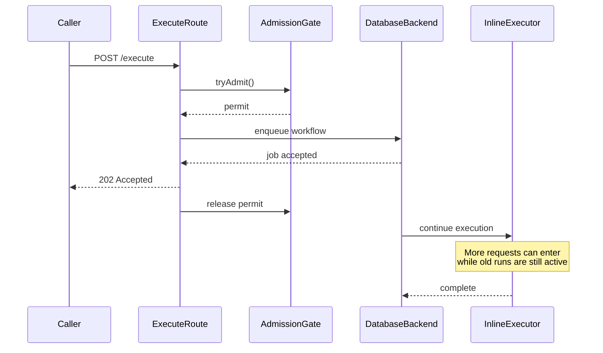
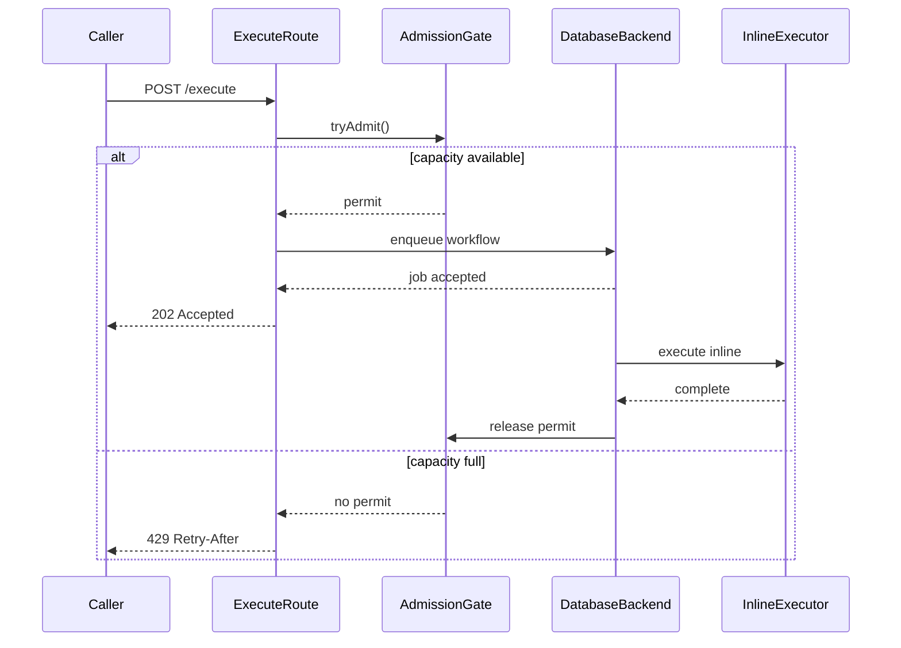

# Sim Workflow Execution Throughput

## Executive summary

The measured local failure was not “the API cannot return fast enough.” It was:

> Sim returned `202 Accepted` faster than workflows finished. The admission
> permit was released when the HTTP response returned, while the local async
> execution continued in the same process. Active work accumulated until the
> process became slow and unreachable.

Throughput is **completed workflows per second**, not `202` responses per
second. This work improves overload behavior and protects the process; it does
not yet claim a production throughput increase.

Scope: local database async backend, synthetic workflow, one web process. These
results are a falsifiable local control-flow finding, not a production capacity
number.

## Before and after

### Before: `202` released capacity too early

### After: permit represents real in-process work

The same admission behavior now applies to cookie-backed **async** requests,
which represent the normal authenticated UI path. Session-backed sync/SSE
requests retain their existing response/stream lifecycle.

## Evidence

Synthetic workflow: `Start → Function`, with 300ms of deterministic CPU work.
Load profile: async `POST /api/workflows/{id}/execute`, ramp to 8 requests/sec,
then hold for 60 seconds.

- Before the fix: approximately 218 successful `202` responses, 225
  `ECONNREFUSED` failures, and roughly 2 completed workflows/sec. The process
  became unreachable.
- At a more aggressive 30 requests/sec probe: 351 requests returned `202`,
  approximately one completion was observed in the window, and more than 280
  executions remained running.
- With `ADMISSION_GATE_MAX_INFLIGHT=5`: 207 `429` responses and repeated
  admission-rejection logs confirmed that the gate rejects at capacity.
- After the fix: the 8 requests/sec rerun produced explicit `202`/`429`
  backpressure and did not reproduce the previous connection-refused cascade.
  One transient health check missed, so this is stability evidence, not a
  claim that the process was perfectly healthy every second.

## Changes in this branch

- Hold the admission ticket through local inline async execution:
  [execute route](../apps/sim/app/api/workflows/[id]/execute/route.ts)
- Apply the gate to session-backed async requests while preserving sync/SSE:
  [execute route](../apps/sim/app/api/workflows/[id]/execute/route.ts)
- Lower the default in-process admission limit from 500 to 10:
  [admission gate](../apps/sim/lib/core/admission/gate.ts)
- Add a 4 GB Node heap ceiling to the production start script:
  [Sim package scripts](../apps/sim/package.json)
- Add workflow execution count/duration telemetry:
  [execution metrics](../apps/sim/lib/workflows/executor/execution-metrics.ts)

The limit of 10 is a safety starting point, not an optimized production
setting. It bounds damage; it does not make execution faster.

## Other chokepoints found or tested

### Proven, not fixed yet

- **Execution cost:** CPU/isolated-runtime work determines how long a permit
  remains occupied. More expensive workflows reduce completion rate and cause
  honest `429` backpressure.
- **Web database pool:** local execution shares the web process and its
  `primaryMax=10` pool. The sustainable limit depends on queries per execution.
- **Trigger worker pool:** with `SIM_DB_ROLE=trigger`, the pool is
  `primaryMax=5`. A 12-way sleep probe took about 6.06 seconds versus 4.04
  seconds on the web pool, with peak active connections of 5.
- **Sync/SSE process pressure:** session-backed sync/SSE requests intentionally
  remain outside this async admission change. Their execution and streaming
  behavior needs a separate test because they run through the web process.

### Tested but inconclusive or not run

- A 20-request synchronous blast completed successfully; it did not reproduce
  an OOM.
- Trigger.dev’s 75/75/50 workflow, webhook, and resume queue contention was
  not tested in this session.
- No production workflow bodies were available. The synthetic graph proves the
  backlog mechanism, not production workload capacity.

## Next falsifiable measurement

Run the same profile through both API-key and authenticated-cookie async
requests. Record:

1. terminal completions/sec from `workflow_execution_logs.ended_at`;
2. `202` versus `429` responses;
3. running execution count;
4. process health and RSS;
5. `pg_stat_activity` for `sim-app`.

Then vary deterministic workflow work from 300ms to 2 seconds. A valid next
finding is: completion rate falls and `429` rate rises while the process stays
healthy. That would identify execution cost as the next ceiling without
pretending to know production input distributions.
