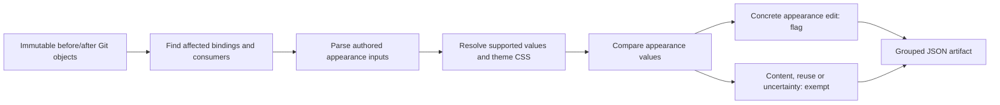

# Design diff

A deterministic, advisory **designer notification filter** for PRs targeting `staging`.
It reports supported changes to authored appearance. It does not run application code,
a build, a browser, AI, proposed configuration or plugins.

```sh
bun run design:diff --base origin/staging --head HEAD --output /tmp/design-diff.json
```

Use Bun **1.4.1** and complete Git history. Revisions resolve to immutable commits;
the comparison is `merge-base(base, head)..head`. Uncommitted files are not analyzed.
With `--output`, JSON is written atomically and findings stay out of logs.

| Result | JSON | Exit |
| --- | --- | --- |
| Completed, no qualifying appearance edit | `status: completed`, `flagged: false` | 0 |
| Completed, qualifying appearance edit | `status: completed`, `flagged: true` | 0 |
| Missing history, unreadable objects, invalid invocation or resource failure | `status: failed`, `flagged: null` | Nonzero |

## Designer policy (version 5)

The public decisions remain `flag` and `exempt`. **Uncertainty alone does not flag.**
Coverage limitations describe what was not established; `flagged: false` is not a claim
that every rendered pixel is unchanged.

| Change | Decision |
| --- | --- |
| Supported colour, background, gradient, border, radius, shadow, opacity | Flag |
| Supported typography, dimensions, padding, margins | Flag |
| Explicit gaps, alignment, positioning mode, flex/grid sizing, wrapping | Flag |
| Authored display/overflow/clipping/layering, animation or scale | Flag |
| Changed shared component styles, CSS variables, themes or CVA definitions | Flag |
| New control/panel with new custom CSS, layout or class overrides | Flag |
| Adding an imported shared component without custom appearance | Exempt |
| Additional dropdown options, rows or controls repeating existing appearance | Exempt |
| Copy, progress/error labels, pricing/privacy wording, documentation prose | Exempt |
| Icons, images, screenshots, inline SVG and media element dimensions | Exempt |
| Font files and font-face changes | Flag |
| Runtime conditions, functional visibility, option data, unknown component props | Exempt |
| Coordinates or translation alone | Exempt |
| Unknown calls, parser/expression limits, plugins and dependency version changes alone | Exempt; retain coverage notes |
| Comments, erased types, supported formatting/constant hoists/local renames | Exempt |

Deleting a shared control also exempts its standard appearance props. Deleted component modules
with no resolved references outside other deleted files are treated as unestablished runtime use,
not designer notifications. Route entry files and active component removals retain normal analysis.

A new `<Button variant="primary" size="sm"/>` uses shared appearance and is exempt.
Adding `<Button className="rounded-none p-6"/>` introduces a custom override and flags.
Changing an existing control's supported `variant`, `size`, classes or style values flags.
Known style values in conditional branches and React state updates are compared; changing
only the runtime predicate, handler or label does not qualify.

Media exclusion applies to recognized JSX/HTML/MDX media elements and asset files. Repository
conventions also identify social-card image generators, landing artwork and the named illustration
functions inside empty-state components. Their surrounding product controls remain in scope.
A passive `div`, `span` or `figure` containing only native media is also exempt. Mixed control/media layouts, event handlers, roles, spreads and unknown children prevent this exemption.
CSS asset URL substitutions and generated copy are exempt. Source-only analysis cannot
reliably identify every project-specific media wrapper.

## How it works



Babel parses TypeScript/JSX, PostCSS parses CSS, parse5 parses HTML and remark parses MDX.
Production extraction focuses on classes, styles, recognized appearance props and native
desktop appearance settings. It skips copy, render guards, arbitrary props and media trees.
Parser failures and bounded unsupported inputs are reported as limitations without becoming
notifications. Application code and configuration are never imported or evaluated.

The import graph is a candidate finder. Specific values are traced through supported constants,
object properties, aliases, re-exports, helpers, CSS variables and class composition. Unchanged
style expressions do not qualify because an unrelated backend dependency changed. Unknown
helper fingerprints and captured inputs are not concrete appearance evidence.

Tailwind **4.3.3** and **tailwind-merge 3.6.0** are pinned direct dependencies. Normalization uses
core utilities and declarative theme/utility/variant CSS from each application. The trusted EMCN
`cn` merge convention includes repository font-size groups. CSS declaration and class composition
order remain significant. Arbitrary JavaScript plugins, external CSS and unknown class helpers
are not executed. Supported core styling can still flag alongside unresolved custom styling.

Appearance definitions are matched by source context and supported values. Repeated styles are
matched across insertions so adding another option does not shift all later findings. Structural
matching is approximate. Changes to unused authored styles and inactive variants can still flag;
runtime-only effects and unsupported rendering may be missed by this precision-oriented policy.

The scope covers product, landing pages, emails, documentation presentation, desktop and shared
components/themes under `apps/` and `packages/`. Tests, fixtures, public image/media assets and server sandbox
bundles are excluded. Font assets remain in scope. Recognized media import modules and resolved icon origins handle aliases.
Media component modules remain available to import resolution so excluding
an Icon does not break resolution of Button through the same barrel.

## Report contract

Schema **3.0.0**, engine **0.6.0**, policy **5.0.0**. The schema and notification policy remain compatible. Readers must inspect versions when comparing historical qualification rates.
All decisions and identifiers are deterministic for the same engine/configuration and commits.
Execution timing and peak memory are recorded separately with `--metrics`, never in engine JSON.

Each top-level finding groups evidence by **changed source file**. A shared Button edit produces
one group, rather than one notification per use. Fields include:

- `source.before` / `source.after`: changed file and Git blob, or `null`.
- `decision`, `category`, `reason`, `symbol`, `before`, `after`: representative evidence.
- `changes`: individual direct source changes and their values/locations.
- `example`: one resolved consumer; its `basis` distinguishes changed evidence from a potential use.
- `impact.before` / `impact.after`: partial counts and locations of resolved static references.
- `consumers`, `dependencies`, `limitations`: supporting references and coverage notes.

Counts are source references, not affected pixels or rendered instances. Unchanged consumers do
not each create a top-level finding. Once the PR qualifies and a nearby consumer has been examined,
further indirect expansion can be omitted with an explicit limitation. All changed files remain
analyzed. A clean result requires examination of all candidate consumers within configured limits.

Small literal values are preserved. Large report values use a preview, full semantic hash and
explicit truncation metadata. Defaults are **4 KiB per preview** and **5 MiB per serialized report**.
Decisions are computed before report truncation. Readers must support `$truncated`, `preview`,
`sha256`, `hashAlgorithm`, `originalBytes`, `previewBytes` and `omittedBytes`. The
`sha256-merkle-v1` hash identifies the complete typed semantic tree without expanding repeated
symbolic subtrees. Oversized reference/detail lists retain deterministic samples and omitted counts.
Large opaque resolver trees can themselves exceed the supported analysis budget; these remain
uncertainty, not evidence of an appearance edit.

Operational failures remain distinct from completed policy exemptions. Configured file-loaded
OpenAPI inputs in the head revision are validated as Git data; content is exempt and malformed
inputs retain diagnostic evidence. Lockfile rendering-dependency changes retain diagnostics but do not qualify by themselves.

## Files

```text
design-diff.config.json                Repository scope, themes and conventions
.github/workflows/design-review.yml    Trusted cloud execution; artifact only
scripts/design-diff/
  cli.ts, index-cli.ts, index.ts        Entry points and operational status
  store.ts, lazy-source.ts             SQLite facts and lazy bounded source reads
  metrics.ts                          Separate stage timings and cache counters
  properties.ts                       Literal nested-property projections
  analyze.ts, git.ts, source.ts        Git snapshots and affected-source analysis
  dependencies.ts                     Binding graph and partial usage counts
  extract/{tsx,css,documents,assets}.ts Syntax extraction
  resolve.ts, ast.ts, refactors.ts     Bounded static resolution
  state.ts, mutations.ts               Referenced state and writes
  finite.ts, environment.ts            Finite key and environment projections
  appearance.ts                       Supported appearance evidence projection
  tailwind.ts                         Pinned compiler and trusted class helpers
  compare.ts, policy.ts                Matching, decisions and categories
  group.ts, report.ts, semantic.ts     Grouping, full hashes and bounded JSON
  inputs.ts                           Configured file inputs
  infrastructure.ts                   Rendering dependency diagnostics
  memory.ts, process.ts                Resource handling
  types.ts, tsconfig.json              Report contract and isolated type check
  benchmark.ts, benchmark/comparisons.json
                                      Immutable-engine historical replay
  tests/                              Source-string/JSON fixtures and regression suites
```

This is repository automation, not a published package. Internal imports use `#design-diff/*`.
The revision-dependent CLI is deliberately outside the generic audit runner.

## Cloud execution and activation

The production workflow targets PRs against `staging`, including drafts, without path filters.
It uses the immutable default-branch engine/configuration, pinned Actions and Bun 1.4.1, read-only
permissions and a 15-minute timeout. Event commits are fetched as data; proposed application code
is neither checked out nor installed. Superseded PR runs are cancelled.

The only findings output is a JSON artifact named `design-diff-<PR>-<head SHA>`, retained for seven
days. There are no comments, labels, annotations or findings summaries. Later consumers must check
`status: completed` and the current PR/head identity. A missing, cancelled or failed run is not clean.
The workflow is advisory and no branch-protection configuration is changed.

**Activation requires the workflow and engine to reach `main`.** Its absence on the draft PR is
not evidence of a passing analysis. A temporary push-triggered benchmark branch can test a pinned
engine before activation; old benchmark and smoke runs do not validate a newer engine.

## Validation and historical replay

```sh
bun run test:scripts
bun run check:script-tests
bun run check:design-diff-types
bun run check:api-validation
bun --no-env-file scripts/design-diff/benchmark.ts \
  --engine /path/to/clean/checkout --sha <immutable-engine-commit> \
  --manifest scripts/design-diff/benchmark/comparisons.json --output /tmp/design-benchmark
```

Script test discovery includes every engine suite. Tests cover explicit appearance edits, exempt
content/reuse/media/uncertainty, shared tokens/themes/variants, matching, Git divergence/renames/
deletions/binaries/unusual names/missing history, deterministic bounded reports and non-execution.
Fixtures stay inside test strings/JSON so application builds and styling scans do not consume them.

The frozen manifest contains the original 120 comparisons plus 60 later sampled holdouts. Its
original labels use a broader visual/content policy and must not be treated as policy-5 ground
truth. Both cohorts have now informed development and are no longer unseen validation. Keep the
engine and configuration fixed while evaluating the next sample, label it independently, and
report disagreements before changing rules. The production CLI never reads benchmark labels or PR
numbers to make decisions; repository conventions belong in configuration, not per-PR exceptions.

The runner verifies exact commits and GitHub file sets. Its cache identity includes immutable
engine SHA, configuration, lockfile, runtime and comparison commits. It records elapsed time,
peak RSS, report size and failures separately. `/usr/bin/time` and Bun 1.4.1 are required. The default
per-comparison deadline is 900 seconds; failed cases remain explicit failures in rate reporting.


## Incremental index (schema 1)

```sh
bun run design:index --ref origin/staging --cache-dir /tmp/sim-design-index
bun run design:diff --base origin/staging --head HEAD \
  --cache-dir /tmp/sim-design-index --output /tmp/report.json --metrics /tmp/metrics.json
bun run design:diff --base origin/staging --head HEAD --no-cache --output /tmp/fresh.json
```

`--no-cache` bypasses disk storage. Both modes use the same analyzer and bounded in-process facts;
there is no completed-report cache in either CLI. Cache files are disposable and should stay outside
source control. `design:index --identity` emits the compatible trusted-tooling identity for CI.

SQLite stores three kinds of derived data:

| Layer | Contents | Validity |
| --- | --- | --- |
| File facts | Module definitions, import/export specifiers, raw references, property projections and parse failures | Git blob, source path/language and trusted tooling identity |
| Revision model | Immutable commit inventory, resolved edges and resolution limitations; on-demand binding summaries | Routing configuration and observed source identities |
| Appearance queries | Normalized ordered styles/variants, ownership, locations and evidence | Observed source blobs plus the affected-context probes actually consulted |

Parser trees remain temporary. Source text has a bounded 96 MiB LRU per revision and serialized
facts have a 64 MiB LRU. Blob reads are lazy and batched. The persistent identity includes index
schema, implementation hashes, trusted dependency lockfile, config, Bun version, OS and architecture.
File paths are part of fact keys because locations are path-dependent; a rename safely recomputes
those facts. Import routing includes the file inventory and project package/alias configuration,
so added files and formerly missing imports invalidate derived queries. CSS theme dependencies and
comparison-specific resolver context are tracked even when an in-process helper was already cached.

Literal exported object properties are projected independently, including nested selectors. Changes
to an unrelated sibling do not propagate into a control that reads another property. Spreads, dynamic
keys, aliases that escape, mutation and changed local helpers retain conservative candidate traversal.
Supported equivalent values still compare cleanly. Cache invalidation is deliberately coarser than
notification decisions: an observed module edit may recompute a query even when its selected appearance
value ultimately stays unchanged. This is not a complete JavaScript type checker or runtime UI model.

Complete snapshots retain the most recent ten commits. Inventory distinguishes indexed source,
intentional exclusions, unsupported formats and unreadable inputs; “indexed” records supported source
coverage, not proof that every runtime expression was resolved. Appearance and usage facts are computed
on demand. The default storage budget is 1 GiB; eviction discards reusable work, not source analysis.
Writes use transactions and checksums. Closing checkpoints WAL; oversized stores are reclaimed.
Corrupt/incompatible databases rebuild, and lock/unavailable-storage failures fall back to transient
analysis. Source/history failures still fail analysis explicitly. The warming command fails if it
cannot persist a baseline. Independent PR jobs never share writable database files.

This follows the disposable persisted-analysis pattern used by
[TypeScript](https://www.typescriptlang.org/tsconfig/incremental.html), dependency-aware lazy queries in
[rust-analyzer](https://rust-analyzer.github.io/book/contributing/architecture.html), and dependency
selection in [Chromatic TurboSnap](https://www.chromatic.com/docs/turbosnap/). It uses
[Bun SQLite](https://bun.com/docs/runtime/sqlite); it does not use those products to render Sim.

## Index maintenance and performance acceptance

`design-index.yml` runs on default-branch manual dispatch, main pushes and a 30-minute schedule.
It refreshes staging using the trusted default-branch engine. Its checkpointed cache key includes
compatible tooling identity, staging SHA, run ID and attempt. PR jobs use only `actions/cache/restore`
and update a disposable local copy. They never save to the shared baseline. GitHub's
[cache restrictions](https://docs.github.com/en/actions/reference/workflows-and-actions/dependency-caching)
remain in force. Unavailable or stale caches must not change reports. Both production workflows
require activation on main. Set `DESIGN_DIFF_INDEX_ENABLED=true` to opt into warming/restoring;
keep it unset if correctness or measured performance acceptance fails.

Reproduce paired measurements, always starting a PR with a baseline-only cache:

```sh
bun --no-env-file scripts/design-diff/benchmark.ts \
  --engine /path/to/clean/checkout --sha <immutable-commit> \
  --manifest /path/to/frozen-manifest.json --output /tmp/design-index-evaluation \
  --workers 2 --profile-index --no-results-cache
```

Each case runs uncached analysis, separately indexes its merge-base in a new cache, then analyzes
its previously unprocessed head. It requires byte-identical reports and deletes that case's disposable
index afterward. Cold/warm/setup metrics, Git read counters, parsing, resolution, comparison, peak
memory and cache hits remain separate files. Stage times are inclusive and must not be summed.
The runtime target is at least 3x median improvement on the same hardware and concurrency; setup
cost and tail latency must be reported separately. The worker cap reserves roughly 3 GiB per worker
and respects available CPU capacity. `--cache-dir` supports ordinary shared local benchmark reuse;
`--profile-index` deliberately uses isolated baseline-only caches instead.

The frozen 180 cases remain development data. Preserve their incomplete/provisional policy-5 labels;
review every changed decision with source evidence and make no claim of unseen accuracy.
