# Design diff

An advisory, deterministic source analyzer for PRs targeting `staging`. It flags visual
changes, including potentially visual effects that cannot be resolved statically.
It does not run an application, a browser, AI, proposed configuration or proposed plugins.

```sh
bun run design:diff --base origin/staging --head HEAD --output /tmp/design-diff.json
```

Use Bun **1.4.1** and a complete Git history. Both revisions are resolved to immutable
commits; the actual comparison is `merge-base(base, head)..head`. Local uncommitted files
are not analyzed. Omitting `--output` writes JSON to stdout. With `--output`, the report is
written through a temporary file and atomically renamed.

| Result | JSON | Exit status |
| --- | --- | --- |
| Completed, no visual findings | `status: completed`, `flagged: false` | 0 |
| Completed, any `flag` finding | `status: completed`, `flagged: true` | 0 |
| Missing revision/history, unreadable objects, invalid invocation or resource failure | `status: failed`, `flagged: null` | Nonzero |

Completed analyses can contain `exempt` movement evidence. Findings have stable IDs,
before/after values, properties, conditions, source locations, symbols, consumers,
dependencies and limitations. Unsupported expressions use syntax fingerprints rather than
duplicating entire function bodies. Reports also include schema, engine and policy versions,
base/head/merge-base SHAs, and workflow PR/head/engine identity. No timestamp enters the
deterministic payload. Finding IDs are stable for the same input pair and engine version.

## Binary decisions and grouped report (schema 2)

The public decisions are **`flag`** and **`exempt`**. Uncertainty produces `flag`, with
the obstacle recorded in `limitations`. Schema and policy version `2.0.0`, engine version
`0.2.0`, replace the earlier public `review` decision and flat consumer findings.

Each finding groups evidence by **changed source file**. Several changed definitions in
one file remain individually available in `changes`. Unchanged downstream consumers do not
each create another top-level finding. For example, a shared Button radius change produces
one finding anchored to its source, with a representative consumer and usage metadata.

| Field | Meaning |
| --- | --- |
| `source.before` / `source.after` | Changed source path and Git blob ID, or `null` for addition/deletion |
| `decision` | `flag` if any grouped evidence requires reporting; otherwise `exempt` |
| `category`, `symbol`, `reason`, `before`, `after` | Representative evidence; its locations can be in an unchanged consumer of a changed token |
| `categories` | Categories of the retained direct evidence and representative consumer |
| `changes` | Direct definition changes in the changed file, retaining individual decisions, values and locations |
| `example` | One consumer evidence record, or `null`; `basis` distinguishes `changed-definition` from `potential-consumer` |
| `impact.before` / `impact.after` | Separate counts and source locations for resolved direct references in each revision |
| `consumers` | Union of files containing those resolved references |
| `dependencies`, `limitations` | Supporting dependencies and retained uncertainty/coverage notes |

`example` is source evidence, not a screenshot or proof of changed pixels. A token-only
file can have an empty `changes` array and a changed consumer as its example. When several
changed sources feed one consumer, the example is marked potential and the attribution
limitation is recorded.

Usage metadata always has `coverage: partial`: it counts resolved references to changed
top-level bindings and their local dependents. JSX uses, function calls and other runtime
references are distinguished. Closing JSX tags, re-export declarations and erased type
references do not count. Dynamic/ambiguous imports are not presented as exact usages.
Zero means no references were enumerated, not proof of no consumers. Overrides, inactive
variants and runtime conditions can prevent a referenced component from changing visually.

Consumers upgrading from schema 1 must read direct evidence from `changes` and the optional
`example`, use `source` to identify the changed file, and stop expecting `decision: review`.

## Architecture

```mermaid
flowchart LR
  Revisions[Base and head revisions] --> Git[Immutable Git objects]
  Git --> Graph[Dependency graphs in both revisions]
  Graph --> Extract[Parse affected visual sources]
  Extract --> Resolve[Bounded static resolution]
  Resolve --> Compare[Compare values and conditions]
  Compare --> Policy[Visual policy and movement proof]
  Policy --> Group[Group by changed source]
  Group --> JSON[JSON report]
```



```text
design-diff.config.json                  Repository scope and recognized conventions
.github/workflows/design-review.yml      Trusted cloud execution, artifact only
scripts/design-diff/
  index.ts                              Small public engine API
  cli.ts                                Arguments, output and operational status
  analyze.ts                            Revision comparison and affected consumers
  git.ts                                Git object reads, merge-base and renames
  source.ts                             Source snapshots and path/alias resolution
  dependencies.ts                       Export-aware imports and source reference counts
  ast.ts                                Babel parsing and syntax normalization
  resolve.ts                            Bounded expression and import resolution
  memory.ts                             Bun parser-batch garbage collection
  tailwind.ts                           Pinned compiler and trusted merge convention
  compare.ts                            Stable matching and findings
  group.ts                              Changed-source grouping and representative evidence
  policy.ts                             Visual categories and limitations
  movement.ts                           Narrow static movement proof
  types.ts                              Versioned report contract
  extract/{tsx,css,documents,assets}.ts   Syntax-specific extraction
  tests/                                Unit/integration suites and JSON fixture text
  tsconfig.json                         Isolated engine type check
```

This is repository automation, not a published package. Internal imports use the root
`#design-diff/*` mapping. The revision-dependent command is deliberately outside the
generic audit runner; the zero-argument engine type check is included in audits.

## Coverage and decisions

Scope includes source under `apps/` and `packages/`: product and landing UI, emails,
documentation, desktop renderers, EMCN, shared workflow rendering, themes and visual assets.
Rendered Markdown is scoped explicitly to application content directories. Tests and fixture
directories are excluded. Fixture source is kept in JSON or test strings, never production
TSX/CSS files that an application build or Tailwind source scan could consume.

| Category | Examples | Decision |
| --- | --- | --- |
| Colour | Foreground, background, fill, gradients | Flag |
| Dimensions | Width, height, padding, min/max size | Flag |
| Typography | Font, size, weight, line height, tracking | Flag |
| Shape/effects | Radius, border, shadow, opacity, filters | Flag |
| Layout | Wrapping, flex/grid sizing, stretching | Flag |
| Visibility | Hidden state, overflow, clipping, layering | Flag |
| Content | Visible copy, JSX/HTML/MDX structure, images, SVG, fonts | Flag |
| Motion | Keyframes, transitions, animation props | Flag |
| Infrastructure | Renderer dependencies, lockfile, CSS processors, module mappings | Flag |
| Movement | Coordinates, translation, margins, gaps, alignment | Flag unless the static proof succeeds |
| Nonvisual/equivalent | Comments, erased types, supported formatting and constant extraction | No finding |

Babel parses JS/TS/JSX; PostCSS parses CSS; parse5 parses HTML; remark parses
Markdown/MDX/frontmatter/GFM. CSS selector, conditional and declaration order are retained.
JSX whitespace follows React's line handling. Class composition and JSX spread/attribute
order remain significant. Direct event handlers are not treated as appearance props; this
does not establish equivalence of arbitrary interactive behavior.

The resolver supports immutable constants, object properties, arrays, primitive template
strings, simple arithmetic, conditional branches, static imports/re-exports, namespace
imports, workspace exports and project `paths` aliases. It records CVA bases, variants,
defaults, compound variants and selections; runtime selections remain symbolic. Recognized
`cn`/`clsx` helpers are interpreted as data. The trusted EMCN `cn` merge convention includes
the repository's custom font-size groups. A helper with an unrecognized origin is not trusted
because its name happens to be `cn` or `clsx`.

Dependency propagation resolves named/default imports, aliases and static namespace members
through named/star re-exports and import-then-export indexes to the defining module. A
Button edit does not implicate a file merely because it imports an unrelated Icon from the
same index. Changed top-level bindings and local dependents narrow the first propagation
step and usage counts within a multi-export file. Both revisions are considered, including
redirected re-exports. Module effects, side-effect imports, computed namespaces, ambiguous
exports, cycles and resolution limits retain conservative dependencies. Further transitive
module effects can still overestimate potential impact.

The resolver reuses the export index, retains at most 128 parsed modules per revision,
and requests Bun garbage collection between parser batches. These resource controls do
not change evidence or decisions. The Node-based test runner uses its own garbage collector.

Tailwind **4.3.3** and **tailwind-merge 3.6.0** are direct pinned dependencies. The compiler
reads declarative theme/custom-variant/utility CSS from each revision, starting with its own
pinned default theme. It preserves alternatives for CSS custom properties instead of assuming
which selector/media condition wins at runtime. Theme changes revisit unchanged consumers in
the configured applications; shared EMCN/renderer classes are considered against both themes.
The pinned `__unstable__loadDesignSystem` API is intentionally isolated in `tailwind.ts` and
covered by tests; upgrading Tailwind requires validating this adapter.

Application JavaScript configs and plugins are never evaluated. External stylesheet packages
are not expanded. The engine identifies unsupported classes and changed rendering
infrastructure for flagging. Compiler output is static core-utility evidence, not a claim that
application plugins or every postprocessor have been reproduced.

Desktop support extracts recognized `BrowserWindow` appearance options, native appearance
setter calls and `nativeTheme.themeSource` assignments. Configured native
menu/tray/terminal-theme modules use an uncertainty fallback, including their changed dependencies,
because embedded JXA and native operating-system rendering are not executed.

## Movement proof and remaining limits

The initial exemption is deliberately narrow: one statically sized `rect` or `circle`, as
the only child of a fixed SVG canvas, changes numeric coordinates while remaining strictly
inside its unchanged viewport. Its geometry, fill and canvas stay unchanged. Styling hooks,
effects, dynamic conditions, nested JSX canvases and potentially overriding repository CSS
disable the exemption. A shape crossing the bounds is flagged. Other positioning changes
are flagged because ancestors, wrapping, stretching, clipping or overlapping content may
change the result. There is no blanket exemption for translation, margins, gaps or alignment.

This engine is conservative, not a runtime equivalence prover:

- Runtime data, arbitrary functions, mutable bindings, dependency cycles, parser failures,
  unknown props and unsupported rendering syntax produce flags with limitations when affected.
- Source-order matching after substantial markup edits can pair different elements. Such
  changes remain flagged; findings are evidence for review, not an exact DOM correspondence.
- Dynamic module/asset paths, inherited/conditional export maps outside the supported forms,
  generated source and arbitrary imperative renderers cannot be fully followed. Directly
  detected DOM/canvas operations and configured native rendering use uncertainty fallbacks.
- MDX expressions and embedded HTML scripts are flagged, without running MDX components or
  scripts. Plain HTML whitespace is preserved because CSS can make it meaningful.
- Broad dependency updates and shared runtime expressions can create false positives. All
  lockfile changes are flagged, including changes to tooling-only dependencies. Inactive
  variants, unused assets and an apparently inert removed class can also be flagged.
- Impact is a conservative approximation. Findings retain direct source changes and one
  consumer example instead of thousands of downstream records. Large changed definitions
  and usage inventories can still produce substantial JSON reports.
- The default limits are 2 MiB per source file, 256 MiB per source snapshot, 24 resolution
  levels and 5,000 evaluation steps per expression. Per-file/parser/expression limits produce
  flags with limitations; snapshot/Git failures are operational failures, never clean results.

## Cloud execution and activation

`design-review.yml` listens for PR opened, reopened, synchronized, edited and ready-for-review
events targeting `staging`, including drafts, without path filters. A manual dispatch from
the default branch accepts an open staging PR number. Newer runs cancel older runs for the
same PR. The job uses the existing Blacksmith/GitHub-hosted runner selection and a 15-minute
timeout, read-only repository permissions, pinned Actions and Bun 1.4.1.

The job resolves the repository's default branch to an immutable SHA, checks out only that
trusted engine/configuration/lockfile, and installs with `--ignore-scripts`. Event base/head
commits are fetched as Git objects. Proposed application code is neither checked out nor
installed. The read-only GitHub token is used for repository metadata and fetches; the
analysis step receives no application secrets.

The sole findings output is a JSON artifact named `design-diff-<PR>-<head SHA>` with **7-day
retention**. No comments, labels, review annotations or findings summaries are created.
Later consumers must require `status: completed` and compare report PR/head identity with
current PR metadata before using the result. A failed/cancelled run or missing artifact is
not a clean analysis. This workflow is advisory; no required-check or branch-protection
configuration is changed.

**Activation requires this workflow and engine to reach `main`, the default branch.** The
dedicated workflow's absence on the initial draft PR is not a passing cloud result.
This follows GitHub's documented
[`pull_request_target` execution context](https://docs.github.com/en/actions/reference/workflows-and-actions/events-that-trigger-workflows#pull_request_target).
Existing PR test/audit CI can validate the new suites before activation.

## Validation

```sh
bun run test:scripts
bun run check:script-tests
bun run check:design-diff-types
bun run check:api-validation
```

Root script-test discovery includes every suite in `tests/`. The fixtures exercise visual
categories, noops, movement, shared imports/themes, source order, documents/native rendering,
Git divergence/renames/deletions/binaries/unusual names/missing history, bounded evaluation,
deterministic output, CLI failure status and non-execution of proposed code/plugins.

The following historical diffs were also inspected manually and compared locally. These
are whole commits, including ancillary changes, rather than only their headline files.

| Commit | Manual expectation | Engine outcome |
| --- | --- | --- |
| `b890e242e0` | Flag: ChipSwitch adds `w-fit`; also changes shared modal/settings source | Flagged; static and unresolved evidence |
| `915833bfc8` | Flag: handler removal itself is not a style change, but the commit also upgrades Radix dependencies/lockfile | Flagged for dependency/runtime uncertainty |
| `3878bd48a1` | Flag: docs screenshots gain explicit dimensions/max-width through an MDX Image component | Flagged; content and MDX expressions |
| `1dd85eb688` | Flag: desktop shell/tab UI and native terminal light/dark palettes change across a large PR | Flagged; visual definitions and native/runtime uncertainty |
| `d51d646d54` | Clean: CLI OAuth refresh documentation comments only | Clean; zero findings |

These comparisons validate source-policy behavior, not rendered pixels or recall over all
historical PRs. Screenshot capture, AI interpretation and Slack delivery are separate stages.

### Incremental smoke test on PR #7742

Five temporary commits were created directly on `458a515cbed7fbcf127ce72348ff755c5308ce13`,
each changing one existing source file. Comparing that commit with each temporary head
isolated the test edit from the implementation PR's own dependency changes. No temporary
UI edits were checked out, pushed or included in the PR.

| Incremental edit | Schema 2 result |
| --- | --- |
| EMCN Button `rounded-[5px]` to `rounded-none` | One flag anchored to Button source, retaining two direct changes and one consumer example |
| Send button token `bg-[#383838]` to `bg-[#E11D48]` | One flag anchored to the token source; `colour` evidence reaches unchanged `SendButton` |
| Send button token `p-0` to `p-2` | One flag anchored to the token source; `dimensions` evidence reaches unchanged `SendButton` |
| TSDoc wording only in EMCN Button | Clean; zero findings |
| Add `translate-x-2` to the send button token | One flag; movement is not proven harmless in this runtime context |

The experiment exposed and fixed dropped semicolons between CSS custom-variant statements
and missing recognition of the repository's `cn` import from `@sim/emcn`. Regression tests
cover both. All five overall flagging decisions matched expectations. Generated translation
declarations still receive the broader `layout` category rather than `movement`; the flag
decision remains conservative.

Schema 1 produced 2,207 findings for the shared shape edit and 93 for each local token edit.
Export-aware propagation and changed-source grouping reduce each of those reports to one
finding. The Button report enumerates 353 direct references in 131 files in each revision;
the local token edits enumerate two references in the single `SendButton` consumer file.
These are partial source-reference counts, not claims that every reference changes visually.
Independent changed source files remain separate findings, and all direct definition changes
within each changed file are retained.

These checks validate local engine behavior, not cloud workflow activation. They are examples,
not a measured detection rate across all possible UI changes.
